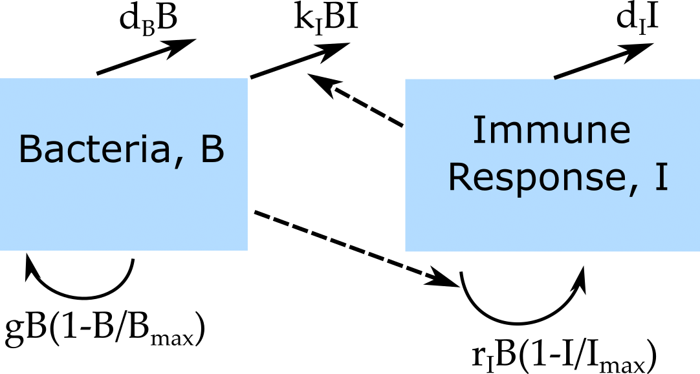

```{r, echo = FALSE}
#this code loads the settings file for the current app so we can automatically 
#list the functions in the further information section
currentrmdfile = knitr::current_input() 
currentappinfo = gsub("_documentation.Rmd" ,"_settings.R",currentrmdfile)
source(currentappinfo)
```

## Overview {#shinytab1}
This app allows exploration of a very basic bacteria infection model, with one compartment for bacteria and one compartment for the immune response. The main goal for this app is to get you familiar with dynamical systems models, as well as the overall setup and ideas behind using these simulations, and how to run them. Read about the model in "The Model" tab. Then do the tasks described in the "What to do" tab.


## The Model {#shinytab2}

### Model Overview
This model is a compartmental model. Compartmental means that we place the agents/players/entities/individuals of interest into distinct compartments. We then only track the total number of individuals in each of these compartments. In this simple model, we track bacteria and some (fairly abstract) notion of immune response strength, using the following notation:

* **B** - bacteria 
* **I** - immune response

This model is of course very simple and abstract. However, as you will see, even with just 2 entities and their interactions, we can get interesting dynamics. This model could be extended by introducing further compartments. For instance we could include separate compartments for the innate and adaptive immune response. You will encounter more detailed models in some of the other apps.

In addition to specifying the *compartments* of a model, we need to specify the dynamics determining the changes for each compartment. Broadly speaking, there are processes that increase the numbers in a given compartment/stage, and processes that lead to a reduction. Those processes are sometimes called in-flows and out-flows. 

For our system, we specify the following processes/flows: 

1. Bacteria grow/divide at some maximum rate (which we label _g_) and saturate as they approach some maximum carrying capacity, _B~max~_. 
2. Bacteria die at a natural death rate (which we label _d~B~_).
3. Bacteria are killed by the immune response at some rate _k_.
4. The immune response grows proportional to the number of bacteria and itself at some rate _r_.
5. The immune response decays at some rate (which we label _d~I~_).


### Model Diagram
A very good way to describe compartmental models and move from a verbal description toward a mathematical/computational formulation is by using diagrams. Being able to go back and forth between verbal description, diagram and mathematical/computational model is a crucial skill when building models. 
The diagram for a compartmental model is often called flow diagram. It consists of a box for each compartment (here **B** and **I**), and arrows pointing in and out of boxes to describe flows and interactions. For the model described above, the flow diagram looks as follows:

```{r BIdiagram,  fig.cap='Flow diagram for simple bacteria infection model.',  echo=FALSE}

```

For the diagrams in this R package, solid arrows indicate physical flows, i.e. movement from a compartment to another (e.g. bacteria moving out of the compartment because of death, or bacteria increasing in the compartment due to growth), while dashed arrows indicate interactions without physical flow (e.g. infected cells killing bacteria). This notation is not universal and it is common in the literature to see no distinction made between these 2 types of flows and only solid arrows being used.

Next, we need to implement this verbal model and flow diagram in a way that it can be run on a computer. While we already specified some of the model features, e.g. that we only track compartments/total numbers and not individual bacteria, both the verbal model and diagram do not yet fully specify the underlying mathematical model. In fact, there are several ways the diagram could be translated into a mathematical/computer model. For this app, we consider two approaches, namely **discrete-time deterministic** and **continuous-time deterministic** models. In some of the other apps, you will see another variant, namely **continuous-time stochastic** model implementations.


### Model Implementation I
The most common way to implement compartmental models is as a **continuous-time, deterministic process, formulated as a set of ordinary differential equations (ODEs)**. Each compartment/variable gets an equation. The right side of each equations specifies the processes going on in the system and how they change the numbers in each compartment via inflows and outflows. For the model described above, the equations look like this:

$$\dot B = g B (1-\frac{B}{B_{max}}) - d_B B - k BI$$ 
$$\dot I = r B I - d_I I$$

**Note that if the equations don't display properly, open the app in a browser, they should look ok there. For some reason, on some systems, the Rstudio internal viewer doesn't render the equations right. If you know how to fix it, let me know!**

We are using here the short-hand notation where a dot over the variable indicates differentiation with respect to time, and we also do not explicitly indicate that all variables depend on time. This is the most common notation. A more detailed, completely equivalent notation is:
$$\frac{d}{dt}B(t) = gB(t)(1-\frac{B(t)}{B_{max}})-d_B B(t) - k B(t)I(t)$$ 
$$\frac{d}{dt} I(t) = r B(t) I(t) - d_I I(t)$$
This notation specifies explicitly that $B$ and $I$ are functions of time, and that the differentiation is with respect to time. Since this is always the case in our models, it is not necessary to be that explicit and the more compact notation shown above is the one you will see in this package and it's also the most common throughout the literature.


### Model Implementation II
Continuous time models implemented as ordinary differential equations are the most common types of models. However, other implementations of the above model are possible. One alternative formulation is a **discrete-time deterministic** equivalent to the ODE model. For such an implementation, the equations are:

$$B_{t+dt} = B_t + dt \left( gB_t (1-\frac{B}{B_{max}}) - d_B B_t - k I_t B_t \right) $$ 
$$ I_{t+dt} = I_t + dt \left( r I_t B_t - d_I I_t \right)$$
In words, the number of bacteria and immune response at a time step _dt_ in the future is given by the number at the current time, t, plus/minus the various growth and death/removal processes. The latter need to be multiplied by the time step, since less of these events can happen if the time step is smaller. As the time-step gets small, this discrete-time model approximates the continuous-time model above. In fact, when we implement a continuous-time model on a computer, the underlying simulator runs a "smart" version of a discrete-time model and makes sure the steps taken are so small that the numerical simulation is a good approximation of the continuous-time model. If you want to learn more about that, you can check out the 'deSolve' R package documentation, which we use to run our simulations. 


### Some notes
* In general, the entities that change in our model (i.e. here **B** and **I**) are called variables: They are variable and change during the simulation. To run a simulation, we need to specify the starting values for each variable. Those are often called _initial conditions_.
* In contrast, the quantities that are usually fixed for a given scenario are called parameters. For this model, those are _g_, _d~B~_, _k_, _r_ and _d~I~_. Values for parameters are chosen to match the known biology of a specific disease/scenario we want to model. All parameters need to be in the same time units, e.g. per day or per hour. 
 


## What to do {#shinytab3}

### A few general notes

* Some of the tasks below (and in future apps) are fairly open-ended. The idea is that these tasks give you something to get started, but you should feel free to explore the simulations any way you want. Play with them, query them, go through iterations of thinking what you expect, observing it, and if discrepancies occur, figure out why. Essentially, the best way to use these apps is to _do your own science/research_ with them.

* You might find for some parameter settings that numbers for bacteria/immune response/virus/cells/etc. drop below 1 (and possibly rebound later). If the units of our model are assumed to be in number of pathogen/cells, this of course is biologically not reasonable. Numbers less than 1 are an artifact of the underlying differential equation model. All ODE models (and the discrete time model we consider here) have that problem. A 'hacky' solution is to monitor the simulation and if a quantity drops below 1, set it to 0 or stop the simulation. A cleaner solution is to treat all entities (virus, cell) as discrete units and allow them to only change in integer steps (in a probabilistic manner). This approach will be discussed in the "Model stochasticity" app. For most apps, neither approach is taken, so you'll see numbers less than 1. That's ok for the purpose we use the apps here. Just be careful if you use these kinds of models in your research you might need to pay attention to this issue.  

* This and most other simulations/apps do not have natural time units (unless specifically stated). You could, therefore, assume that your model runs in units of days or minutes/hours/weeks/months..., based on what's most suitable for the system you want to study. You have to make sure that all your parameters are in the right time units. Always make sure to check if a given simulation can handle different time units or assumes specific ones. In general, I specify for each "What to do" section what kind of units I have in mind for the different tasks.

**The tasks below are described in a way that assumes everything is in units of days (rate parameters, therefore, have units of inverse days). If any quantity is not given in those units, you need to convert it first (e.g. if it says a cell lives for a week, you need to convert it to 7 days, then take the inverse if you want a death rate, which is what usually goes into the model).**


### Task 1: 
Start with the following parameter settings in your model:

* 100 initial bacteria, an initial level of 1 for the immune response, a simulation start time of 0 and final time of 100 (which we assume to be days).
* Assume bacteria grow at a rate of 1 per day, the carrying capacity is 10^5^ and they live for about 2 days (the inverse of the lifespan is the rate of death).
* Assume the immune response is activated at a rate of 10^-4^, kills bacteria at a rate of 10^-4^ and decays at a rate of 2 per day.
* Only run the continuous time ODE model. Therefore, the value for the time-step _dt_ for the discrete model does not matter, you can leave it as is. Plot both x- and y-axes on a linear scale.

Run the simulation, see what you get. You should see some oscillations and then the system settles down, with bacteria and immune response at the end of the simulation at around 19996 and 3003. 

### Task 2: 
* Switch the plotting to have x-axis, y-axis or both plotted on a log scale. 
* Leave all other settings as before.
* Note that while the look of the plot changes a lot, nothing has changed about the underlying simulation. The results are exactly the same in each case, only plotted differently. This is something to be aware of when you see plots in papers or produce your own. The best plot to use is the one that shows results of interest in the clearest form. Usually, the x-axis is linear and the y-axis is either linear or logarithmic.

### Task 3: 
* Go back to both linear scales for plotting.
* Set "Models to run" to "both"", which runs and shows both the continuous-time and discrete-time models.
* Start with a discrete-time step of 0.01.
* Leave all other settings as before.

Run the simulation, see what you get. You should see the results from the 2 models essentially on top of each other and barely distinguishable.

### Task 4: 
* Now try different values for _dt_. 
* Leave all other settings as before.

You should notice that as _dt_ gets larger, the differences between discrete-time and continuous-time models increase. At a time step above 0.1, the results start to look very different. Once you go about around 0.5 for the time-step, it becomes so large that for these parameter settings, the simulation 'crashes' and you get an error message.


### Task 5: 
* Set _dt_ to 0.6. 
* Leave all other settings as before.
* Run the simulation. It should not work, you should get an error message.
* Now play with the bacteria growth rate parameter and see for what values you can get the discrete-time simulation to work again.

### Task 6: 
* Turn off the discrete-time simulation, set everything back as in task 1.
* What do you expect to see if you now change the bacteria growth rate from 1 to 2? Think about your expectations, then run the simulation to see what you get. If your see something you didn't expect, or didn't know what to expect, try to make sense of the results. 
* Play around with the bacteria growth rate, try different values and see how it affect the results.

### Task 7: 
* Set everything back as in task 1.
* Now repeat what you did in the previous task, but this time investigate how changes in the immune response death rate parameter affect results. 
* __Make sure to always go through the iterative 'think about expectations -> run simulation -> update understanding' process (i.e. 'do science' with the model).__

### Task 8: 
* Set everything back as in task 1.
* Set y-axis to log for the plot.
* Set immune response death rate to 0.1.

You should get a plot where bacteria numbers drop to below 1 and take on fractional values (e.g. 10^-4^ or less). Contemplate what that means. This is one of the draw-backs of ODE based models, and we'll revisit this topic in the stochastic apps.

### Task 9: 
* Go crazy :) change any parameters you want to change, see how it affects the results.
* While going crazy, remember to continue to think about what you are doing and what you are seeing and what it all means...


## Further Information {#shinytab4}

* This app (and all others) are structured such that the Shiny part (the graphical interface you see and the server-side function that goes with it) calls an underlying R script (or several) which runs the simulation for the model of interest and returns the results.
* For this app, the underlying functions running the simulation are called ``r appsettings$simfunction[1]`` and ``r appsettings$simfunction[2]``. You can call them directly, without going through the shiny app. Use the `help()` command for more information on how to use the functions directly. If you go that route, you need to use the results returned from this function and produce useful output (such as a plot) yourself. 
* You can also download all simulator functions and modify them for your own purposes.  Of course to modify these functions, you'll need to do some coding.
* For examples on using the simulators directly and how to modify them, read the package vignette by typing `vignette('DSAIRM')` into the R console.
* The model we are exploring here belongs to a class of well-studied models in ecology known as predator-prey models. If you want to learn more about these kinds of models, see e.g. [@otto11]. The models in those references are described in the context of ecology, but results transfer to within-host situation. 
* For somewhat similar within-host models (applied to TB and antibiotic resistance), see [@antia96; @handel09b].

### References


