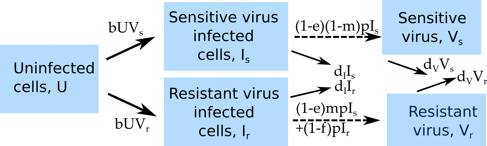

```{r, include = FALSE}
#*************************************
#general setup to define package and get path locations
#all paths are inside the package and retrieved with system.file
packagename = "DSAIRM"
helperdir = "helperfunctions"
mbmodeldir = "mbmodels"
figuredir = "media"
appdocdir = "appinformation" 
#*************************************
#Note: for this to process/knit, several helper functions need to be available (sourced) first
#those are in the inst/helperfunctions folder
#Note: in general, the "processing-script.R" in the docsfordevelopers should be used to produce the html docs
#manual knitting of each doc only during development/testing
#*************************************
files_to_source = list.files(system.file(helperdir,package = packagename),full.names=TRUE)
sapply(files_to_source, source) #sourcing needs to happen inside each Rmd file since knitr starts a new environment
#load the settings file for the current app 
#so we can automatically include figure, list the functions in the further information section
#and use other information specific to the current app for the task table generation
currentrmdfile = knitr::current_input() 
appsettings = get_settings(currentrmdfile,appdocdir,packagename)
```


## Overview {#shinytab1}
This app allows exploration of a stochastic model that simulates emergence of drug resistance during an acute virus infection (e.g. influenza) in the presence of an antiviral. Read about the model in the "Model" tab. Then do the tasks described in the "What to do" tab.


## The Model {#shinytab2}

### Model Description
This model is a modification and extension of the model described in the "Model Stochasticity" app. Here, we track 2 types of virus, wild-type and drug sensitive, and a resistant mutant. We also consider the presence of a drug. 

This model consists of 5 compartments:

* **U** - uninfected cells 
* **I_s** - cells infected with drug sensitive virus
* **I_r** - cells infected with drug resistant virus
* **V_s** - drug-sensitive virus
* **V_r** - drug-resistant virus


For this model, we consider the following processes: 

1. Drug-sensitive or drug resistant Virus infects uninfected cells at (the same) rate _b_.
2. Drug-sensitive infected cells produce new drug-sensitive virus at rate _(1-m)p_ and occasionally generate a resistant mutant virus at rate _mp_. 
3. Drug-resistant infected cells produce new drug-resistant virus at rate _(1-f)p_. The factor _f_ accounts for the cost of fitness generally observed for drug resistant strains.
4. Sensitive and resistant virus are both removed at rate _dV_, loss of virus due to infecting new cells is ignored.
5. A drug reduces production of sensitive virus by a factor _e_, it does not affect resistant virus.

For simplicity, we ignore the possibility that a cell might be infected by both drug sensitive and infected virus and might produce a mix of them.

### Model Diagram


```{r resistancemodeldiagram,  fig.cap='Flow diagram for the drug resistance model.',  echo=FALSE}

```


### Model Equations
*If* we were to implement this model as a continuous-time, deterministic model, it would have the following set of ordinary differential equations. 


$$\dot U =  - bUV_s - bU V_r$$
$$\dot I_s = bUV_s - d_I I_s$$
$$\dot I_r = bUV_r - d_I I_r$$
$$\dot V_s = (1-e)(1-m)pI_s - d_V V_s$$
$$\dot V_r = (1-e)mpI_s + (1-f)pI_r - d_V V_r$$


*However* we use a stochastic model here. For such a model, the differential equation formulation is not valid. One can write down an equivalent formulation as a stochastic model by specifying every possible process (also called transition/event/reaction) that can occur and their propensities (the propensity multiplied with the time step gives the probability that a given process/event/transition occurs). For our model these are the following:

Event type                |  Transitions                |   Propensity                       |
----------                |  -----------                |   ----------                       |
drug sensitive infection  |  U => U-1, I_s => I_s + 1   |   b*U*V_s                          |
drug resistant infection  |  U => U-1, I_r => I_r + 1   |   b*U*V_r                          |
death if I_s              |  I_s => I_s - 1             |   dI*I_s                           |
death if I_r              |  I_r => I_r - 1             |   dI*I_r                           |
production of V_s         |  V_s => V_s + 1             |   (1-e)*(1-m)*p*I_s                |
removal of V_s            |  V_s => V_s - 1             |   dV*V_s                           | 
production of V_r         |  V_r => V_r + 1             |   (1-e)*m*p*I_s + (1-f)*p*I_r      |
removal of V_r            |  V_r => V_r - 1             |   dV*V_r                           | 


## What to do {#shinytab3}

Notes: 

* For this simulation, you can set a random number seed. This ensures reproducibility. If you choose the same seed and run the simulation twice, the same random numbers are generated and you get the same trajectory. To get different results, you can change the random number seed. This is NOT a model parameter, just something that controls the randomness during the simulations.
* For this stochastic model, all variables need to be integer values, including starting values. If you provide a non-integer value the model will fail.

### Task 1 
* Confirm that you get a single infection with sensitive virus with the default settings.
* Set 'resistant generation fraction' to a small non-zero value. You should start seeing some resistant virus. Why is it lower than the sensitive virus?

### Task 2 
* Set 'resistant generation fraction' to 0.01. Run simulation for different drug efficacy values. Observe how the magnitude of the _V~s~_ and _V~r~_ curves change and eventually for high enough drug efficacy, no infection takes place anymore.


### Task 3 
* Set drug efficacy to 0.4, everything else as before.
* Run simulation for different values of resistant fitness cost. Observe how the magnitude of the _V~s~_ and _V~r~_ curves change.
* Explore how different values for drug efficacy (which affects _V~s~_) and fitness cost (which affects _V~r~_) lead to different outcomes.

### Task 4 
* Repeat or continue your explorations with more than one stochastic simulation being run.


## Further Information {#shinytab4}
* This app (and all others) are structured such that the Shiny part (the graphical interface you see and the server-side function that goes with it) calls an underlying R script (or several) which runs the simulation for the model of interest and returns the results.
* For this app, the underlying function running the simulation is called ``r appsettings$simfunction``. You can call them directly, without going through the shiny app. Use the `help()` command for more information on how to use the functions directly. If you go that route, you need to use the results returned from this function and produce useful output (such as a plot) yourself. 
* You can also download all simulator functions and modify them for your own purposes.  Of course to modify these functions, you'll need to do some coding.
* For examples on using the simulators directly and how to modify them, read the package vignette by typing `vignette('DSAIRM')` into the R console.
* A very similar model was used and explored in [@handel07] and reference [@canini14a] analyzed a similar, more detailed model.


### References


