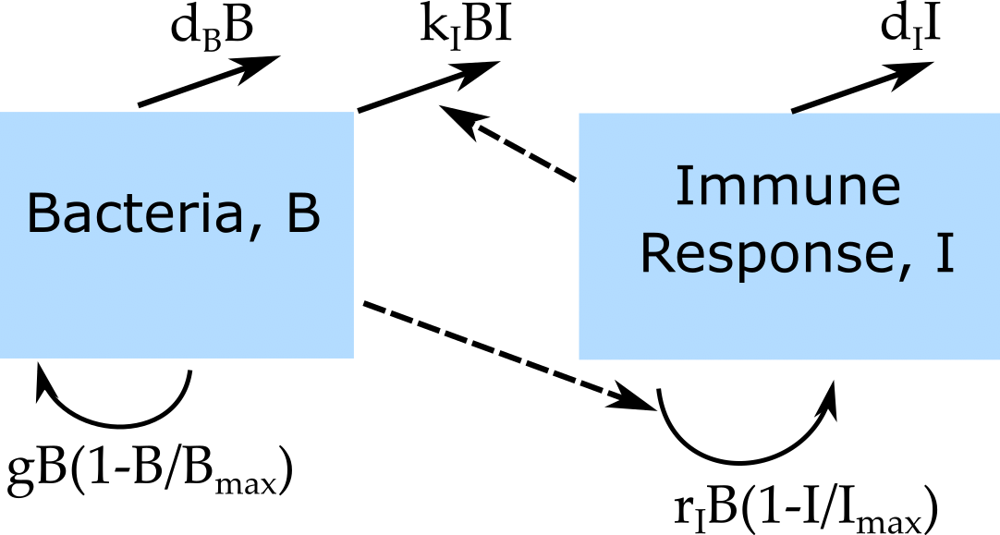

```{r, echo = FALSE}
#this code loads the settings file for the current app so we can automatically 
#list the functions in the further information section
currentrmdfile = knitr::current_input() 
currentappinfo = gsub("_documentation.Rmd" ,"_settings.R",currentrmdfile)
source(currentappinfo)
```

## Overview {#shinytab1}
This app allows you to explore the effect of specific model parameters on some outcomes of interest for the simple bacteria model. Read about the model in the "Model" tab. Then do the tasks described in the "What to do" tab.


## The Model {#shinytab2}

### Model Overview
The model used here is the one introduced in the 'Simple Bacteria Model' app. If you haven't done so, check out and explore that app first. Here we are only considering the continuous time, ordinary differential equation implementation of the model.

What's different here compared to the 'Simple Bacteria Model' app is that instead of running the simulation once for a given choice of parameter values and looking at the resulting time-series, this app lets you explore the impact of each model parameter on some outcomes. Specifically, we consider the maximum number of bacteria and immune response, and their values at the end of the simulation, when the system has settled down to a steady state. To ensure a steady state, you need to run the simulation for a long enough time. A steady state corresponds biologically to a chronic infection condition.

In the app, those 4 outcomes of interest are labeled _Bpeak_, _Ipeak_, _Bsteady_ and _Isteady_. You can choose one of the model parameters to be varied between some minimum and maximum value. The other parameter values remain fixed. For each parameter value, the model is run and the 4 outcomes of interest computed. The resulting plot is one showing how those 4 outcomes of interest vary with the parameter you investigated.


### Model Diagram and equations
As mentioned, this is the same model as used in the 'Simple Bacteria Model' app. Details can be found there. For ease of reference, the flow diagram and the equations of the continuous model are shown again here:

```{r BIdiagram,  fig.cap='Flow diagram for simple bacteria infection model..',  echo=FALSE, out.width = "70%"}

```

$$\dot B = gB(1-\frac{B}{B_{max}})-d_B B - k BI$$ 
$$\dot I = r B I - d_I I$$


## What to do {#shinytab3}

*The tasks below are described in a way that assumes everything is in units of days (rate parameters, therefore, have units of inverse days).*

### Task 1: 
* Set initial bacteria and immune response to 100 and 10.
* Set bacteria growth and death rate to 2 and 1. The former value does not matter since we'll be exploring the simulation for different values of _g_.
* Set carrying capacity to 10^5^, IR kill rate and activation rate to 10^-4^ and immune response death rate to 2.
* Choose _g_ as the parameter to vary, go from 2 to 10, do 10 different parameter values, linear spacing, and no log scales for plotting.
* Set maximum simulation time to 100. Run simulation, check to ensure all simulations reach steady state (see output message below plot). Then reduce simulation time to 20 days, note how some simulations did not reach steady state and how that affects results.

### Task 2: 
* Play around with the number of different parameter values (the higher the number, the more often the simulation runs and the longer it takes), the minimum and maximum, and linear or logarithmic spacing and plotting.
* Think a bit about the results you see in the plot for the different outcomes. Would you have expected that as the bacteria growth rate increases, the peak bacteria load increases? What about the fact that the peak and steady state immune response increases? And what about the steady state bacteria not increasing? 


### Task 3: 
* Take a look at the model equations and diagram and see if by 'staring' at them, you can understand why you got the results you saw in the last task. 

With enough practice, it is often possible to intuit specific results based on the underlying equations - but that requires a good bit of modeling practice. As models get more complicated, even experienced modelers can often not intuit what model behavior one should expect as specific parameters vary. Often the only way to find out is by actually running the simulations.

### Task 4: 
The model we have here is so simple that we can in fact figure out two of the outcomes shown in the plot without having to run simulations but instead by doing some math. Specifically, we can compute the steady states for the bacteria and immune response variables. If you have done the basic virus tasks, you have encountered the steady state idea already. We repeat it here.

Once the system has settled down, there are no more changes in the numbers for each compartment. Mathematically, that means that the left side of the differential equations becomes 0, and they turn into the following algebraic equations:
$0 = gB(1-\frac{B}{B_{max}})-d_B B - k BI$ and $0 = r B I - d_I I$. One can solve those equations for each of the compartments to get a mathematical expression of what _B_ and _I_ are at steady state. Try to do this. You should find that $B_{steady} = d_I / r$ and a similar equation for $I_{steady}$. 

### Task 5: 
* Compare the mathematical equations you found in the previous task with what you find in the plots. Things should be consistent, i.e. if the plot shows that _B~steady~_ does not depend on _g_, the mathematical equation should show the same. Similarly, since the plot shows that _I~steady~_ increases with _g_, that should be reflected in the mathematical equation for _I~steady~_ you got above.

We cannot compute similar mathematical expressions for _B~peak~_ and _I~peak~_. In general, as soon as our model reaches a certain level of complexity (maybe around 5 equations and more), getting analytic/mathematical equations for most outcomes of interest is not possible and the numerical approach of running the simulations and looking at the results is the only option we have.

### Task 6: 
* Let's explore the impact of a different parameter. Set all variables as in task 1.
* Choose _d~I~_ as the parameter to vary and set lower and upper limit to 1 and 10.
* Before you run the model, look at your equations for _B~steady~_ and _I~steady~_ and based on these, predict what you should see in the plot.
* Similarly, look at the model equations and try to intuit what you might expect _B~peak~_ and _I~peak~_ to do as you increase _d~I~_. 
* Now run the model, compare the results with your expectations. How do they agree or disagree?

### Task 7: 
* In the previous task, you should have noticed 2 different patterns of the outcomes for _d~I~_ less than 5 and greater than 5. Try to understand what happens (qualitatively) with your model in those 2 regimes and how that leads to the results you are seeing. 

### Task 8: 
* Do the same explorations you did above for any other parameter you want to investigate. 

Note that here we focus on a single parameter at a time. With some coding effort, we could change the underlying simulation to loop over say 2 parameters and produce outcomes for sets of parameter values, e.g. _B~peak~_ as a function of _g_ and _r_. The results could be plotted as a 2-dimensional heatmap. While this could be extended to more than 2 parameters, it will become hard to visualize and long to run. If there are many parameters that could change, a different approach is useful, which you'll learn about in the Uncertainty and Sensitivity App.


## Further Information {#shinytab4}
* This app (and all others) are structured such that the Shiny part (the graphical interface you see and the server-side function that goes with it) calls an underlying R script (or several) which runs the simulation for the model of interest and returns the results.
* For this app, the underlying function running the simulation is called ``r appsettings$simfunction``. You can call them directly, without going through the shiny app. Use the `help()` command for more information on how to use the functions directly. If you go that route, you need to use the results returned from this function and produce useful output (such as a plot) yourself. 
* You can also download all simulator functions and modify them for your own purposes.  Of course to modify these functions, you'll need to do some coding.
* For examples on using the simulators directly and how to modify them, read the package vignette by typing `vignette('DSAIRM')` into the R console.
* Some 'real world' examples where models have been used to explore outcomes of interest as function of parameters for simple models applied to TB, see e.g. [@antia96] (specifically Figure 2B) or Malaria, see e.g. [@kochin10]. 

### References


