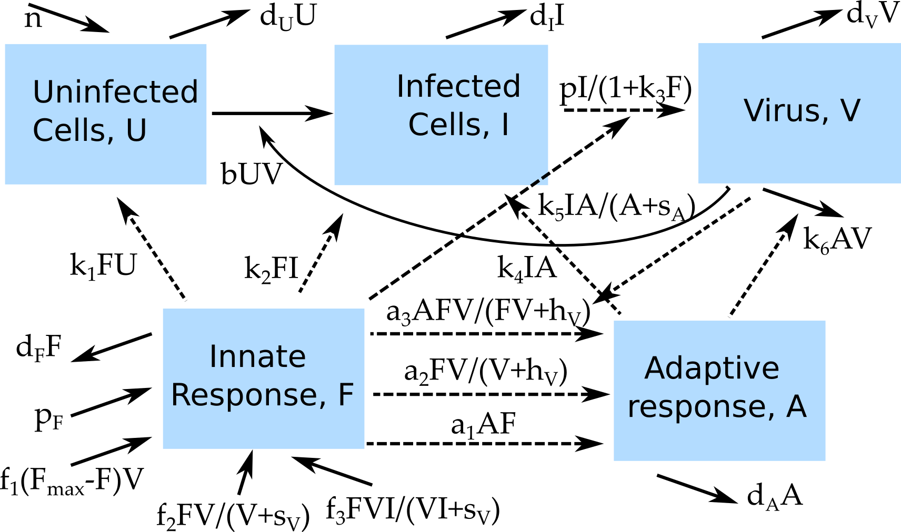

```{r, echo = FALSE}
#this code loads the settings file for the current app so we can automatically 
#list the functions in the further information section
currentrmdfile = knitr::current_input() 
currentappinfo = gsub("_documentation.Rmd" ,"_settings.R",currentrmdfile)
source(currentappinfo)
```

## Overview {#shinytab1}
This app allows exploration of the impact of different model formulations on the results obtained from a simulation. Read about the model in the "Model" tab. Then do the tasks described in the "What to do" tab.


## The Model {#shinytab2}

### Model Overview
This model consists of several compartments that capture some of the basic dynamics of virus and immune response during an infection. In this model, we track the following entities, by assigning each to a compartment:

* **U** - uninfected cells 
* **I** - infected cells
* **V** - (free) virus
* **F** - innate immune response
* **A** - adaptive immune response

Both the innate and adaptive response are modeled in a rather abstract manner. We could think of them as some kind of cumulative representation of each arm of the immune response, or alternatively a single dominant innate response component, e.g. interferon for the innate and CD8 T-cells for the adaptive response. 

In addition to specifying the *compartments* of a model, we need to specify the dynamics determining the changes for each compartment. Broadly speaking, there are processes that increase the numbers in a given compartment/stage, and processes that lead to a reduction. Those processes are sometimes called in-flows and out-flows. 

For the purpose of this app, we specify several alternative processes that allow us to explore different model variants by 'turning on and off' specific components of the model.

We specify the following processes/flows: 

* Uninfected cells are produced at rate _n_, die naturally at rate _d~U~_ and become infected at rate _b_.
* Infected cells die at rate *d~I~* and produce virus at rate _p_.
* Free virus is removed at rate _d~V~_ due to any unmodeled processes, or goes on to infect further uninfected cells at rate _b_. 
* In the absence of virus, the innate response is produced at a rate *p~F~* and removed at a rate *d~F~*. In the presence of virus, the innate response additionally *grows* according to 3 alternative model formulations:
    A) Proportional to virus at rate *f~1~* and saturating at a maximum level *F~max~*. 
    B) Proportional to virus at rate *f~2~*, with a growth rate saturating at high levels of virus, determined by the saturation constant *s~V~*. 
    C) Proportional to both virus and infected cells at rate *f~3~*, with a growth rate saturating at high levels of virus and infected cells, determined by the saturation constant *s~V~*.
* The innate response can also *act* on the system in 3 different ways: 
    A) By moving target cells into a "protected" state at rate *k~1~* where those cells can not become infected any longer.
    B) By inducing death of infected cells at rate *k~2~*. 
    C) By reducing production of virus particles at strength *k~3~*.
* The adaptive response *growth* is also modeled according to 3 alternative model formulations:
    A) Proportional to the innate response at rate *a~1~*. 
    B) Proportional to virus at rate *a~2~*, with a growth rate saturating at high levels of virus, determined by the saturation constant *h~V~*.
    C) Proportional to both virus and innate response at rate *a~3~*, with a growth rate saturating at high levels of virus and innate response, determined by the saturation constant *h~V*~.
* The adaptive response can *act* on the system in 3 ways: 
    A) By killing infected cells at rate *k~4~*. 
    B) By killing infected cells at rate *k~5~*, with saturation of the maximum killing rate for high adaptive response levels, determined by the saturation constant *s~A~*. 
    C) By killing virus at rate *k~6~*.
* Adaptive immune response decays at a rate *d~A~*.

The idea explored in this app and implemented by this model is that results sometimes, but not always, change depending on different (biologically reasonable) ways the immune response is modeled. We can explore those different models by setting certain parameters describing alternative processes to a non-zero value, and all others to zero. We can then study how different model alternatives affect the outcome.

Obviously, the number of alternative models we could make that are biologically reasonable is virtually endless. The better the underlying biology of a given infection is known, the easier it is to pick one model formulation over another. In the end, for most infections, we still don't know enough to pick the "right" model. We often have to choose one or a few reasonable model candidates and hope that they approximate the underlying processes reasonably well.

### Model Diagram

<div class = "diagramfig">
```{r modelvariants,  fig.cap='Flow diagram for the model with different innate and adaptive response variants.',  echo=FALSE, out.width = "60%"}

```
</div>

### Model Equations


$$\dot U =n - d_U U - bVU - k_1FU $$
$$\dot I = bVU - d_II - k_2FI - k_4 A I - k_5 \frac{A I}{A+s_A}$$
$$\dot V = \frac{pI}{1+k_3 F} - d_VV - bVU - k_6AV$$
$$\dot F = p_F - d_F F + f_1  V (F_{max} - F) + f_2  \frac{V}{V+s_V} F + f_3  \frac{VI}{VI+s_V} F$$
$$\dot A = a_1 F A + a_2\frac{V}{V+h_V}F + a_3  \frac{F  V}{ F  V + h_V}  A $$


## What to do {#shinytab3}

_It is recommended that before you work your way through this app and tasks, you first explore and do the tasks in the "Basic Virus Model" and "Virus and Immune Response Model" apps._ 

_For the tasks below, it is assumed that the model is run in units of days_

### Task 1: 
* We'll begin with the basic virus model by turning off any immune response related component.
* Set all parameter values related to the immune response such that there is no _F_ and _A_ present at any time during the simulation.
* Set target cell and virus starting conditions to 10^5^ initial uninfected cells, no infected cells, 10 virions. 
* Set infection rate to 10^-5^, no production or death of uninfected cells, lifespan of infected cells and virus of 1 day and 6 hours respectively. Rate of virus production should be 100 per day.
* You should get a single acute virus infection with no immune response present and a maximum of 70217 infected cells.

### Task 2: 
* Let's explore different mechanisms for the innate response. Keep initial level of innate response at 0, but set innate production and removal rate to 1. Set all innate growth parameters (the _f~i~_) and all innate actions (_k~1~_, _k~2~_, _k~3~_) to 0. 
* Run the simulation, confirm that you get an innate response that settles at a steady state (balance between production and removal), but that there is no further increase and that the rest of the dynamics doesn't change (i.e. you should get the same maximum number of infected cells as above).

### Task 3: 
* Now explore the different types of innate response induction by playing with the _f~i~_ parameters and the saturation parameter, _s~V~_. Relate what you see in the plots to the equations so you get an idea of how different terms in the equations behave. Continue to keep the _k~i~_ at 0. This means the rest of the variables should not change.

### Task 4: 
* Now explore what happens when you have non-zero _k~i~_. You'll find that the action of the innate response impacts the other variables, which in turn can impact further innate activation. Some of the resulting dynamics can get complex.
* Pay attention to how different processes of innate activation and innate action do or don't produce different overall dynamics.

### Task 5: 
* Finally turn on the adaptive response. Note that in this model, there is no adaptive response without innate response (check it by setting the innate response to 0 while having non-zero adaptive growth rates, _a~i~_).
* Turn the innate response back on and explore how different non-zero adaptive growth rates, _a~i~_, affect the adaptive response dynamics. Start by leaving the adaptive action parameters at 0. Then play with those parameters as well and set them to non-zero values. Also explore the impact of the saturation constants.

### Task 6: 
* As you'll notice, some of the specific model choices (i.e. specific parameters/terms in the model being turned on or off) lead to similar results, while other times results are quite different. For a specific system under study, some ways to formulate the immune response and the dynamics one gets might be better than others. Think about a system you are familiar with and consider which (if any) of the possible mechanisms implemented in this model might best describe that system.


## Further Information {#shinytab4}
* This app (and all others) are structured such that the Shiny part (the graphical interface you see and the server-side function that goes with it) calls an underlying R script (or several) which runs the simulation for the model of interest and returns the results.
* For this app, the underlying function running the simulation is called ``r appsettings$simfunction``. You can call them directly, without going through the shiny app. Use the `help()` command for more information on how to use the functions directly. If you go that route, you need to use the results returned from this function and produce useful output (such as a plot) yourself. 
* You can also download all simulator functions and modify them for your own purposes.  Of course to modify these functions, you'll need to do some coding.
* For examples on using the simulators directly and how to modify them, read the package vignette by typing `vignette('DSAIRM')` into the R console.
* Explorations of different models and their impacts on outcomes for acute virus infections in general can be found in e.g. [@li14] and a more detailed discussion of previously published models and comparison to data for influenza can be found in [@dobrovolny13]. 

### References


