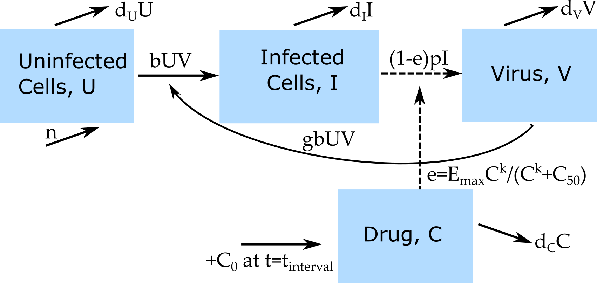

```{r, echo = FALSE}
#this code loads the settings file for the current app so we can automatically 
#list the functions in the further information section
currentrmdfile = knitr::current_input() 
currentappinfo = gsub("_documentation.Rmd" ,"_settings.R",currentrmdfile)
source(currentappinfo)
```

## Overview {#shinytab1}
This app allows exploration of a basic virus infection model in the presence of treatment. Drug pharmacokinetics (Pk) and pharmacodynamics (Pd) is included in the model. Read about the model in the "Model" tab. Then do the tasks described in the "What to do" tab.

### Learning Objectives
* Be familiar with a simple Pk/Pd model
* Appreciate the impact different drug Pk/Pd can have on pathogen dynamics

## The Model {#shinytab2}

### Model Overview
This model consists of 4 compartments modeling a the basic dynamics of a viral infection in the presence of a drug. In this model, we track the following entities by assigning each to a compartment:

* **U** - uninfected cells 
* **I** - infected cells
* **V** - (free) virus
* **C** - drug concentration

In addition to specifying the *compartments* of a model, we need to specify the processes governing the model dynamics. For our system, we specify the following processes/flows: 

* Uninfected cells are produced at some rate _n_ and naturally die at some rate _d~U~_.
* Virus infects cells at rate _b_, with unit conversion factor _g_.
* Infected cells produce new virus at rate _p_ and die at rate _d~I~_.
* Free virus is removed at rate _d~V~_ or goes on to infect further uninfected cells. 
* Once treatment has started (_t_ > _t~xstart~_),  a new drug dose, _C~0~_, is administered at fixed time intervals (_t~interval~_), which increases _C_ at that time to _C_ + _C~0~_. This is modeled by an instantaneous increase. In between every dose, drug kinetics is modeled as decaying exponentially at rate *d~C~*. 
* The efficacy of the drug, *e*, depends on the concentration of the drug, given by a so called Emax-equation. *E~max~* is the maximum efficacy at high drug concentration (and should be between 0 and 1), *C~50~* is the drug concentration at which the drug has half its maximum efficacy, and the parameter *k* dictates how rapidly efficacy increases as drug concentration increases.

### Model Diagram
The diagram illustrating this compartmental model is shown in the figure.

```{r PkPddiagram,  fig.cap='Flow diagram for a virus infection model with drug treatment and Pk-Pd.',  echo=FALSE, out.width='70%'}

```


### Model Equations
Implementing this model as a continuous-time, deterministic model leads to the following set of ordinary differential equations. 

$$\dot U = n - d_U U - bUV$$ 
$$\dot I = bUV - d_I I$$
$$\dot V = (1-e)pI - d_V V - gb UV$$
$$\dot C =  - d_C C, \qquad C=C+C_0 \textrm{ at } t = t_{interval} $$ 

*t~interval~* is the time at which a new drug dose is given. Prior to treatment start, i.e. (_t_ < _t~xstart~_), there is no drug and *C=0*. The drug efficacy _e_ is given by its own equation which depends on _C_ as follows:
$$e = E_{max} \frac{C^k}{C^k+C_{50}}$$


## What to do {#shinytab3}

### Task 1: 
For the first few tasks, we consider an acute viral infection and treatment (e.g. influenza and neuraminidase inhibitor drugs). The model is assumed to run in units of days.

* Set number of uninfected cells to 10^5^, 10 virions, no infected cells.
* We make the assumption that on the timescale of an acute infection (several days), the processes of natural, uninfected cell turnover are so slow that they can be ignored. Set values for the uninfected cell birth and death rates to reflect this assumption. 
* Assume that infected cells have an average lifespan of 1 day, virus of 12 hours.
* Set virus production rate to 10, infection rate to 10^-5^ and conversion factor to 1, simulation time 20 days.  
* For the drug, assume treatment starts at day 10 and occurs daily thereafter at a dose of 1. Drug decays at a rate of 1.
* Set the efficacy increase parameter to 1, the 50% efficacy level to 1 and max drug efficacy to 0.
* Run the simulation. You should get 28694 infected cells at the peak and a max drug dose of 1.55.


### Task 2: 
* Since max drug efficacy was 0, the drug had no impact. Now change to maximum impact by setting this parameter to 1. What do you expect to see? What do you see?
* Now start drug treatment earlier, at days 9,8,.. down to day 1. Observe how the drug now has more of an impact.

### Task 3: 
* Let's explore the Pk part of the model, i.e. the kinetics of the drug. Start drug on day 5, leave everything as above.
* Explore how different dosing intervals affect the drug Pk and thereby the virus load.
* Explore how different drug decay rates affect the drug Pk and thereby the virus load.
* Explore how different drug doses affect the drug Pk and thereby the virus load.

### Task 4: 
* Now we'll explore the Pd part of the model, i.e. the equation describing drug action. Go back to settings at the beginning of task 3 (i.e. task 1 settings with treatment start at day 5 and max drug efficacy).
* Explore how different 50% efficacy levels affect the virus load.
* Explore how different values for the drug efficacy increase parameter affect the virus load.
* Explore how different drug max drug efficacy levels affect the virus load. Note that the highest biologically reasonable value for _E~max_ is 1, which means 100% efficacy. While you can stick higher values into the model, they don't make any sense (you'll be getting negative virus production). 
* Note that for all the changes you did above, the drug time-series did not change.

### Task 5: 
* Go back to settings at the beginning of task 3 (i.e. task 1 settings with treatment start at day 5 and max drug efficacy).
* Assume your goal was to prevent as many uninfected cells from getting infected as possible. For that purpose, would you want to try and double the half-life of the drug (i.e. reduce decay rate by a factor of 2) or to reduce the concentration at which the drug has 50% action by half? (You should find around 56819 uninfected cells for one of the scenarios and around 64799 for the other).
* If drug side-effects were an issue, would your decision change? Why or why not?

### Task 6: 
* Let's consider a chronic situation. Set everything as in task 1, then set birth rate and death rate of uninfected cells to 10000 and 0.1.  
* For the drug, assume treatment starts at day 50, max simulation time of 100 days, and drug is given weekly at a dose of 1.
* Set the efficacy increase parameter to 1, the 50% efficacy level to 1 and max drug efficacy to 1.
* Run the simulation. You should see an infection settling to some steady state, then drug treatment starts and virus levels go up and down with around 24389 at 100 days. Importantly, the virus does not show some overall decline, it only goes up and down. Make sure you understand why that is.

### Task 7: 
* Play with the different Pk parameters as described in task 3 and see how it affects virus load and what is needed to get the virus to low levels.

### Task 8: 
* Play with the different Pd parameters as described in task 4 and see how it affects virus load and what is needed to get the virus to low levels.


## Further Information {#shinytab4}
* This app (and all others) are structured such that the Shiny part (the graphical interface you see and the server-side function that goes with it) calls an underlying R script (or several) which runs the simulation for the model of interest and returns the results.
* For this app, the underlying function running the simulation is called ``r simfunction``. You can call them directly, without going through the shiny app. Use the `help()` command for more information on how to use the functions directly. If you go that route, you need to use the results returned from this function and produce useful output (such as a plot) yourself. 
* You can also download all simulator functions and modify them for your own purposes.  Of course to modify these functions, you'll need to do some coding.
* For examples on using the simulators directly and how to modify them, read the package vignette by typing `vignette('DSAIRM')` into the R console.
* If you want to learn a bit more about these kinds of models, see e.g. [@powers03; @talal06; @handel09b; @canini14a]. 


### References


