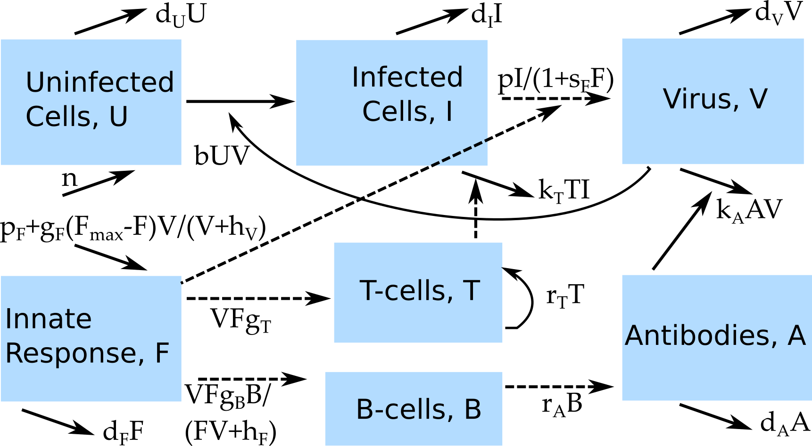

```{r, echo = FALSE}
#this code loads the settings file for the current app so we can automatically 
#list the functions in the further information section
currentrmdfile = knitr::current_input() 
currentappinfo = gsub("_documentation.Rmd" ,"_settings.R",currentrmdfile)
source(currentappinfo)
```

## Overview {#shinytab1}
This app allows exploration of a virus infection model that includes several components of the immune response. Read about the model in the "Model" tab. Then do the tasks described in the "What to do" tab.


## The Model {#shinytab2}

### Model Overview
This model consists of several compartments that capture some of the basic dynamics of virus and immune response during an infection. In this model, we track the following entities, by assigning each to a compartment:

* **U** - uninfected cells 
* **I** - infected cells
* **V** - (free) virus
* **F** - innate immune response
* **T** - CD8 T-cells
* **B** - B-cells
* **A** - Antibodies

The innate response is modeled in a rather abstract sense. We could think of it as some form of cumulative effect of all innate response components, or alternatively a single dominant innate response component, e.g. interferon. If one knows more about a specific system and has enough data, one can of course include the innate response in more detail (i.e. with several compartments) in the model. For the sake of simplicity, we only look at a single compartment.

In addition to specifying the *compartments* of a model, we need to specify the dynamics determining the changes for each compartment. Broadly speaking, there are processes that increase the numbers in a given compartment/stage, and processes that lead to a reduction. Those processes are sometimes called in-flows and out-flows. 

For our system, we specify the following processes/flows: 

1. Uninfected cells are produced at some rate _n_ and naturally die at some rate _d~U~_.
2. Virus infects cells at rate _b_.
3. Infected cells die at rate _d~I~_ and are killed by T cells at rate *k~T~*.
4. Free virus is produced at a maximum rate _p_, the innate response suppresses virus production at a strength given by the parameter *s~F~*. Virus is removed at rate *k~A~* by antibodies, at rate _d~V~_ due to any other (unmodeled) processes, or goes on to infect further uninfected cells at rate _b_. 
5. The innate response is produced at a rate *p~F~* and removed at a rate *d~F~* in the absence of an infection. It is induced by virus presence at a maximum rate *g~F~*, which saturates for high virus numbers as determined by the parameter *h~V~* and reaches a maximum carrying capacity given by *F~max~*.
6. T-cells are induced by the presence of virus and the innate response at rate *g~T~*. After induction, T-cells grow exponentially at rate *r~T~*.
7. B-cells are induced and grow proportional to virus and innate response levels at a rate *g~B~*, with a saturation for high virus and immune response levels determined by parameter *h~F~*
8. Antibodies are produced by B-cells at rate *r~A~*, decay at rate *d~A~* and are removed through binding to and clearing virus at rate *k~A~*.

We are ignoring the death of T-cells and B-cells in this model. As such, it is only applicable to systems where we want to study the dynamics during the growth/expansion phase of the adaptive response and not further. This is valid for most acute infections, but would not be a suitable model for something like HIV or other chronic viral infections.

While this model and these processes make some biological sense, there are many other possible alternatives one could formulate the detailed processes going on. Based on what you know about the system you want to model, you might have good information about some of the components and for other parts you will have to make reasonable assumptions. Another app deals specifically with this issue of having different ways to formulate a model and how that can sometimes impact results. For this app, reasonable terms were chosen with a focus on showcasing a variety of different ways certain immune response processes are often implemented.


### Model Diagram
The diagram illustrating this compartmental model is shown in the figure.


```{r VirusIR,  fig.cap='Flow diagram for virus infection model with several immune response components.',  echo=FALSE, out.width="70%"}

```


### Model Equations
Implementing this model as a continuous-time, deterministic model leads to the following set of ordinary differential equations. 

$$\dot U = n - d_U U - bUV$$ 
$$\dot I = bUV - d_I I - k_T T I$$
$$\dot V = \frac{pI}{1+s_F F} - d_V V - b UV - k_A AV$$
$$\dot F = p_F - d_F F + \frac{V}{V+ h_V}g_F(F_{max}-F) $$ 
$$\dot T = F V g_T + r_T T$$

$$\dot B = \frac{F V}{F V + h_F} g_B B$$
$$\dot A = r_A B - d_A A - k_A A V$$

    


## What to do {#shinytab3}

*The tasks below are described in a way that assumes everything is in units of days (rate parameters, therefore, have units of inverse days). If any quantity is not given in those units, you need to convert it first (e.g. if it says a week, you need to convert it to 7 days).*


### Task 1: 
* Start with 10^5^ uninfected cells, no infected cells, 10 virus particles and no initial B-cells, T-cells or antibodies. Note that the initial condition for the innate response is set to its steady state value in the absence of a pathogen, *p~F~*/*d~F~*. This is hard-coded, if you wanted to change this, you will have to edit the underlying simulation code.
* Set birth and death rate of uninfected cells to 0.
* Assume that infected cells have a life-span of 1 day, and virus has a life-span of 6 hours.
* Assume that the virus production by an infected cell is 100 virions per day and that the rate at which new cells become infected is 10^-5^.
* Turn off all immune response components for now by setting production rate and growth rate of the innate response to 0. (The death rate needs to be non-zero, otherwise you get an error message because of the way the steady state is computed.)
* By looking at the equations, convince yourself that if you have no B-cells and no baseline production and extra induction of the innate response (*p~F~*=*g~F~*=0), all immune response quantities will be and remain at 0, no matter what you set the remaining parameters to.
* Run your model for 30 days, start at 0 and set the time step for which solutions are returned to 0.01.
* Confirm/test with the model that this is the case.
* If you run the simulation with the settings above, you should get a single acute infection with a peak number of infected cells of around 70217.

### Task 2: 
* Now we'll slowly add immune response components. We start with the innate response.
* Set innate response production rate to 100, removal rate to 1. Leave innate growth rate at 0.
* Set T-cell induction  rate to 0.
* Set virus reduction by innate response parameter to 10^-12^ (almost 0).
* Leave everything as before.
* By looking at the equations, convince yourself that while there will now be an innate response, it does not affect the infection dynamics. Also convince yourself that there will still be no B-cells and T-cells.
* Run the simulation to confirm/test. You should find the innate at a steady level of 100, and an infection that is as before, with again a peak of around 70217 infected cells.

### Task 3: 
* Allow the innate response to impact virus production by increasing *s~F~*. Contemplate what you expect to see, check with the simulation.
* Now allow the innate response to grow in the presence of the virus by setting innate growth to a non-zero value. Explore different values.
* Explore the innate response by trying different values for all innate response related parameters (i.e. *p~F~*, *d~F~*, *g~F~*, *s~F~*, *h~V~* and *F~max~* )
* If you are somewhat familiar with a specific virus and know how the kinetics of (some component of) the innate response should look, try to find parameter values that give you something that might be a reasonable approximation to the real system for all variables (uninfected cells, infected cells, virus, innate response).

### Task 4: 
* Now instead of having the innate response reduce virus production, we consider its effect on T-cell activation.
* Set everything as in task 2, then set T-cell induction rate to 0.1 and T-cell growth rate to 0.5.
* Set T-cell killing rate close to 0 (e.g. 10^-20^). Contemplate what you'd expect to see, run the simulation to confirm.
* You should see the same size acute infection as before, namely with around 70217 infected cells. You will also see T-cells growing.
* Now allow T-cells to kill infected cells by increasing the killing rate. First formulate your expectation, then test with the simulation.
* As killing rate increase, you should see a steeper decline of infected cells and virus toward the end of the infection. The peak will also be somewhat affected.
* Play around with the parameters that directly govern T-cell kinetics and impact (*r~T~*, *g~T~*, *k~T~*), as well as any parameters that indirectly impact T-cells through changing the innate response strength (i.e. everything you explored in the previous task). 

### Task 5: 
* We now explore B-cell/antibody response.
* Set everything as in task 2, B-cell growth rate rate to 0.5 and saturation constant to 10^2.
* Assume B-cells produce antibodies at a rate of 100 per day, and antibodies live an average of 1 day. Assume virus removal by antibodies is negligible, i.e. set it to 10^-20^.
* Run the simulation. Why don't you see any increasing numbers of B-cells and antibodies? Hint: Look at the equations and the initial conditions.
* Remedy the previous problem by setting the initial number of B-cells to 1. You should now see both B-cells and antibodies grow. If you run the simulation for 20 days, you should have around 4048 B-cells at the end of the simulation.
* The maximum number of infected cells is as before. I'm sure it's clear why: While the B-cells and antibodies are there now, they don't "do" anything just yet.
* Allow the antibodies to impact virus by slowly increasing the virus removal rate, *k~A~*. You will see an interesting pattern for the antibodies with a pronounced dip. Try to understand why that happens.

### Task 6: 
So far, we have only had a single immune response component at a time act on the virus or infected cells. Now it's time to look at "everything". This is a free and open exploration. Turn on any and all immune response components you like, play around with any other parameters, and see what happens. You might notice that the model - while still in some sense fairly small and simple - is nevertheless already fairly complex, with lots of 'knobs to turn' and parameters to adjust, and things going on. This is a challenge when building models: Smaller models are less realistic, but easier to build and study. Larger models are potentially more realistic, but harder to build, harder to study, and if you want to apply the model to a specific pathogen, you will need to find values for all the model parameters somewhere in the literature. That's often tricky. 


## Further Information {#shinytab4}
* This app (and all others) are structured such that the Shiny part (the graphical interface you see and the server-side function that goes with it) calls an underlying R script (or several) which runs the simulation for the model of interest and returns the results.
* For this app, the underlying function running the simulation is called ``r simfunction``. You can call them directly, without going through the shiny app. Use the `help()` command for more information on how to use the functions directly. If you go that route, you need to use the results returned from this function and produce useful output (such as a plot) yourself. 
* You can also download all simulator functions and modify them for your own purposes.  Of course to modify these functions, you'll need to do some coding.
* For examples on using the simulators directly and how to modify them, read the package vignette by typing `vignette('DSAIRM')` into the R console.
* An example of a model similar to the above applied to influenza, see e.g. [@handel10]. 


### References


