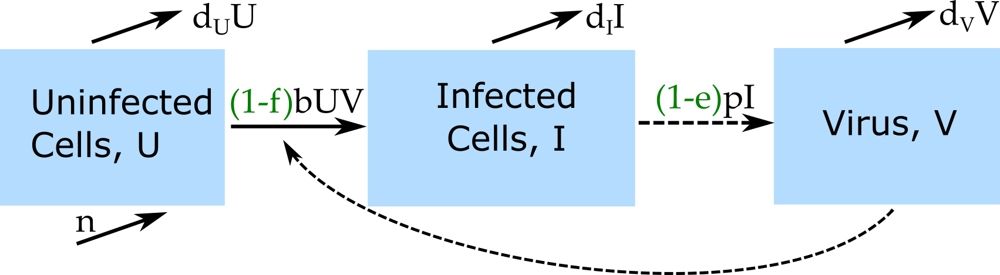

```{r, echo = FALSE}
#this code loads the settings file for the current app so we can automatically 
#list the functions in the further information section
currentrmdfile = knitr::current_input() 
currentappinfo = gsub("_documentation.Rmd" ,"_settings.R",currentrmdfile)
source(currentappinfo)
```


## Overview {#shinytab1}
This app allows exploration of a basic virus infection model in the presence of a drug. Read about the model in the "Model" tab. Then do the tasks described in the "What to do" tab. Learn more about the model and its origins in the "Further Information" tab.


## The Model {#shinytab2}

### Model Overview
This model is a variation of the 'Basic Virus" model. A detailed description of the basic virus model can be found in the corresponding app. The model for this app includes drug treatment and differs from the basic virus model in the following ways:

* The drug can reduce infection of uninfected cells at a strength/efficacy given by the parameter _f_. This value is between 0 (completely ineffective) and 1 (100% effective).
* The drug can reduce production of progeny virus at a strength/efficacy given by the parameter _e_. This value is between 0 (completely ineffective) and 1 (100% effective).

Note that the drug is not explicitly modeled here, it is not given its own compartment/equation. Instead, we model the drug by its effects on some of the model parameters, and assume that this effect is either absent or present but does not otherwise change with time. The _Pharmacokinetics and Pharmacodynamics_ app provides a model that includes explicit modeling of drug uptake and decay.

### Model Diagram
The diagram illustrating this compartmental model is shown in the figure.

```{r virandtxdiagram,  fig.cap='Flow diagram for the virus infection and drug treatment model.',  echo=FALSE}

```


### Model Equations
Implementing this model as a continuous-time, deterministic model leads to the following set of ordinary differential equations. 

$$\dot U = n - d_U U - (1-f)bUV$$ 
$$\dot I = (1-f)bUV - d_I I$$
$$\dot V = (1-e)pI - d_V V - gbUV$$


## What to do {#shinytab3}

### Task 1: 
For the first few tasks, we consider an acute viral infection and treatment (e.g. influenza and neuraminidase inhibitor drugs). The model is assumed to run in units of days.

* Set number of uninfected cells to 10^5^, 10 virions, no infected cells.
* We make the assumption that on the timescale of an acute infection (several days), the processes of natural, uninfected cell turnover are so slow that they can be ignored. Set values for the uninfected cell birth and death rates to reflect this assumption. 
* Assume that infected cells have an average lifespan of 1 day, virus of 12 hours.
* Set virus production rate to 10, infection rate to 10^-5^ and conversion factor to 1. 
* Set simulation time to 20 days, both drug effects to 0, 'start at steady state' should be set to 'no'.  
* Run the simulation. You should get 28694 infected cells at the peak.
* Just for fun, set 'start at steady state' to 'yes', think about your expectations, run simulation and ensure your expectation and result agree.

### Task 2: 
* Set 'start at steady state' back to 'no'. 
* Assume treatment starts at day 10 and it works through reduction of cell infection. Try different values for _f_ (between 0 and 1) and see how results change. 
* Repeat the same, now assuming that the drug works through reduction of virus production.
* Repeat those steps assuming treatment starts at day 7. Then do it again with treatment start on day 5.

### Task 3: 
* If you knew the drug would be administered at day 4 and it reduced infection of cells by 50%, what do you predict the maximum number of infected cells would be?
* Use the model to predict if it would be better to design a drug that either reduces cell infection by 50% or virus production by 50% (and that drug was given on day 4)
* Use the model to predict if it would be better to double drug efficacy for reducing virus production from 40% to 80%, or decide to give drug on day 2 instead of day 4.
* Can you find a scenario (i.e. values for the different model parameters) in which giving drug at day 2 instead of day 4 beats the 40% vs 80% approach?


### Task 4: 
For the next few tasks, we consider a chronic viral infection and treatment (e.g. HCV or HIV). The model is assumed to run in units of days.

* Set all parameters as in task 1, but now allow for uninfected cell births (10000 per day) and cell death (rate of 0.001)
* Run the simulation for 100 days. You should reach a steady state with 44900 virions present.
* Set set 'start at steady state' to 'yes', confirm that all your variables stay at the steady state level they reached in the previous setting.

If you need an introduction or refresher on what the steady state means and how one could compute it, see the "Basic Virus" app.

### Task 5: 
A model like this has been applied to study the interferon treatment for Hepatitis C Virus [@neumann98]. (Today's standard of care for HCV does not involve interferon anymore, but it is still a useful example to consider). One question the investigators wanted to answer is if one of the 2 mechanisms, i.e. reduction of cell infection (parameter _f_) or reduction of virus production (parameter _e_) is better at explaining/predicting observed viral kinetics.

* Set starting conditions to 10^7^ uninfected cells, no infected cells, 10 virions.
* Set uninfected cell birth rate to 10000, death rate to 0.001.
* Set the infected cell lifespan to 5 days, virus production rate to 100, virus lifespan to 4 hours, infection rate 10^-7^, conversion factor 1, no treatment. 
* Run simulation for 400 days with and without starting at steady state. Confirm that you end up with about 821667 virions at the end of the simulation. Plotting with y-axis on a log scale is likely best.

### Task 6: 
* Now set 'start at steady state' to 'yes'. Note that this will ignore the starting values for _U_, _I_ and _V_ and instead compute the steady state from the model parameters (using the equations you learned about in the "Basic Virus" app).
* Run the simulation for 20 days and turn on treatment at 10 days. Try different strengths of treatment efficacy (values for parameters _f_ and _e_). It might be useful to plot the y-axis on a logarithmic scale to better see the virus kinetics.
* If you learned that the observed viral load kinetics after treatment start was a fast decline followed by a slower decline, which of the 2 drug action mechanisms would you predict is more likely to happen? Or do you need both mechanisms present, or can neither reproduce a bi-phasic fast-then-slow virus load decline? 

### Task 7: 
* Keep parameter settings as in the previous task. For a drug that reduced the rate of infection of cells by 80%, what virus load do you predict on day 30 (with treatment start on day 10)?  
* If you were told that the virus load you just found was reached with a drug that reduced viral production, approximately what drug efficacy would you predict? (Answer 0.63, confirm that you get this).  

### Task 8: 
* Run the simulations from task 6 for a longer time and observe what the different variables do.
* Change some of the other model parameters around and investigate how this affects the impact of the drug treatment in the model.


## Further Information {#shinytab4}

* This app (and all others) are structured such that the Shiny part (the graphical interface you see and the server-side function that goes with it) calls an underlying R script (or several) which runs the simulation for the model of interest and returns the results.
* For this app, the underlying function running the simulation is called ``r appsettings$simfunction``. You can call them directly, without going through the shiny app. Use the `help()` command for more information on how to use the functions directly. If you go that route, you need to use the results returned from this function and produce useful output (such as a plot) yourself. 
* You can also download all simulator functions and modify them for your own purposes.  Of course to modify these functions, you'll need to do some coding.
* For examples on using the simulators directly and how to modify them, read the package vignette by typing `vignette('DSAIRM')` into the R console.
* For some examples of models that were used to study antivirals in acute infections, specifically influenza, see e.g. [@handel07; @beauchemin08; @canini14a].
* For some examples of models that were applied to antiviral treatment in chronic infections (HIV, HCV), see e.g. [@neumann98; @dixit04].

### References

