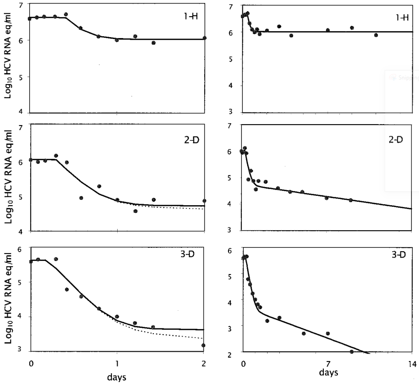

```{r, include = FALSE}
#load various variable definitions that are the same for each app
source('startup_script.R')
sapply(files_to_source, source) #source some helper files defined in the files_to_source variable
currentrmdfile = knitr::current_input()  #get current file name
appsettings = get_settings(currentrmdfile,appdocdir,packagename) #get settings for current app
```


## Overview {#shinytab1}
This app allows exploration of the ___Basic Virus Model___  in the presence of a drug. The idea is to explore the results for two hypothetical mechanisms of a drug. By comparing the model results with data, you can get hints as to the mechanism by which the drug might act. In this app, no explicit, statistical comparison to data (i.e. fitting to data) is implemented. Instead, you are asked to compare patterns obtained from the model and from real data qualitatively. The ___Influenza Drug Model___ app addresses a similar question and fits to data.

Read about the model in _The Model_ tab. Then, work through the tasks described in the _What To Do_ tab. Learn more about the model and its origins in the _Further Information_ tab.


### Learning Objectives
* Understand how one can compare models to data to learn about potential underlying mechanisms.
* Learn how to formulate models that represent different scientific hypotheses.
* Learn how both timing and strength of drug can impact infection outcomes.


## The Model {#shinytab2}

### Model Overview

This model is a variation of the basic virus model. A detailed description of the model can be found in the ___Basic Virus Model___ app. You should go through that app first. 

Here, we add drug treatment to the model in  the following ways:

* The drug can reduce the rate of infection for uninfected cells at a strength/efficacy given by the parameter _f_. This value is between 0 (completely ineffective) and 1 (100% effective).
* The drug can reduce production of progeny virus at a strength/efficacy given by the parameter _e_. This value is between 0 (completely ineffective) and 1 (100% effective).


### Model Diagram
The diagram illustrating this compartmental model is shown in the figure. The two new processes in which the drug can potentially work are indicated in color.


```{r modeldiagram,  fig.cap='Model Diagram',  echo=FALSE}
knitr::include_graphics(path = paste0("../media/",appsettings$modelfigname))
```


### Model Equations

Implementing this model as a continuous-time, deterministic model leads to the following set of ordinary differential equations: 


\begin{align}
\dot U & = n - d_U U - (1-f)bUV \\ 
\dot I & = (1-f)bUV - d_I I \\
\dot V & = (1-e)pI - d_V V - (1-f)gbUV
\end{align}


### Model Concepts

We'll be comparing our model results to data from hepatitis C virus- (HCV-) infected individuals who received interferon (IFN) treatment. The following figure from [@neumann98] shows the data we'll be referring to in some of the tasks. One often observes viral load kinetics following treatment that starts with a fast decline followed by a slower decline.

```{r, fig.cap='HCV virus load in patients following IFN treatment.',  echo=FALSE}

```


### Notes

* The drug is not explicitly modeled here, it is not given its own compartment/equation. Instead, we model the drug by its effects on some of the model parameters and assume that this effect is either absent or present but does not otherwise change with time. The ___Pharmacokinetics and Pharmacodynamics___ app provides a model that includes explicit modeling of drug uptake and decay.

* Efficacy and effectiveness are not *technically* the same measures, but, with respect to our computer simulations, we will use the terms interchangeably.


## What To Do {#shinytab3}

**The model is assumed to run in units of days.**

```{r, echo=FALSE, eval=TRUE}

#this is the running counter for the records which starts at 1 
rc=1

#empty object, will hold all outcomes
alloutcomes = NULL

#########################
# Task 1
#########################
tid = 1
tasktext = "For the first few tasks, we consider an acute viral infection and treatment (e.g., influenza and neuraminidase inhibitor drugs). Set number of uninfected cells to 10^5^, 10 virions, no infected cells.  We make the assumption that on the timescale of an acute infection (several days), the processes of natural, uninfected cell turnover are so slow that they can be ignored. Set values for the uninfected cell birth and death rates to reflect this assumption. 

\nWe assume that infected cells have an average lifespan of 1 day, virus of 12 hours. Set their death/clearance rates accordingly. Set virus production rate to 10, infection rate to 10^-5^ and conversion factor to 1. Start at day 0, run for 30 days, time step 0.1. Both drug effects should be at 0 (thus, the value for txstart doesn't matter). _Start at steady state_ should be off.  Run the simulation. 

\nYou should get the usual infection curve with 28694 infected cells at the peak. Compute the total number of infected cells based on the initial and final values of the uninfected cells."
nrec = 1 # number of items to record
out_records = c("Total number of infected cells (round to integer)")
out_types = rep("Rounded_Integer",nrec)
out_notes = rep("Report the rounded integer",nrec)
outcomes = data.frame( TaskID = rep(tid,nrec),
                       TaskText = rep(tasktext,nrec),
                      RecordID = paste0('T',tid,'R',(1:nrec)),
                      Record = out_records, 
                      Type = out_types, 
                      Note = out_notes)
alloutcomes = rbind(alloutcomes,outcomes)
rc = rc + nrec #increment record counter by number of outcomes to record for this task 

#########################
# Task 2
#########################
tid = tid + 1
tasktext = "Now, assume treatment is 50% effective at reducing the rate at which cells get infected, and treatment starts at day 10 after infection. Run the simulation. You should find that with treatment starting this late, the peak does not change. The total number of infected cells went down a little bit. Next, assume that treatment starts earlier, on day 5. Run model again, you'll see a stronger reduction."
nrec = 2 # number of items to record
out_records = c("Total number of infected cells, _txstart_ = 10 (round to integer)", 
                "Total number of infected cells, _txstart_ = 5 (round to integer)")
out_types = rep("Rounded_Integer",nrec)
out_notes = rep("Report the rounded integer",nrec)
outcomes = data.frame( TaskID = rep(tid,nrec),
                       TaskText = rep(tasktext,nrec),
                      RecordID = paste0('T',tid,'R',(1:nrec)),
                      Record = out_records, 
                      Type = out_types, 
                      Note = out_notes)
alloutcomes = rbind(alloutcomes,outcomes)
rc = rc + nrec #increment record counter by number of outcomes to record for this task 


#########################
# Task 3
#########################
tid = tid + 1
tasktext = "Use the model to explore and predict if it would be better to double drug efficacy for reducing virus infection rate from 40% to 80%, or decide to give the drug on day 2 instead of day 4. That is, first run a hypothetical drug that is given on day 4 and reduces infection rate by a factor of 0.4. Then, try for day 4/0.8, and day 2/0.4 and see which of these combinations leads to reduced infection (as measured by total number of infected cells)."
nrec = 1 # number of items to record
out_records = c("TRUE or FALSE: The day 2/40% efficacy scenario leads to less infected cells compared to the day 4/80% efficacy scenario.")
out_types = rep("Logical",nrec)
out_notes = rep("Report TRUE or FALSE",nrec)
outcomes = data.frame( TaskID = rep(tid,nrec),
                       TaskText = rep(tasktext,nrec),
                      RecordID = paste0('T',tid,'R',(1:nrec)),
                      Record = out_records, 
                      Type = out_types, 
                      Note = out_notes)
alloutcomes = rbind(alloutcomes,outcomes)
rc = rc + nrec #increment record counter by number of outcomes to record for this task 


#########################
# Task 4
#########################
tid = tid + 1
tasktext = "Let's repeat the previous exploration with slightly different values. Compare a hypothetical drug that's 100% effective at reducing infection of cells and given at day 10 versus a drug that's 50% effective and given starting at day 5. You should find that the perfect drug given late has less of an impact at reducing the total number of infected cells than the less effective drug given earlier. Then, repeat for the perfect drug given at day 8 versus the 50% effective drug given at day 4. Investigate both the total number of infected cells and the peak virus load. You should see that while the perfect drug given later is better at reducing the total number of infected cells, the less good drug given earlier is better at reducing the peak. Depending on which outcome is clinically more important, one or the other combination might be preferred (if one had a choice)."
nrec = 2 # number of items to record
out_records = c("Virus peak for drug with _f_ = 1, _txstart_ = 8",
                "Virus peak for drug with _f_ = 0.5, _txstart_ = 4")
out_types = rep("Rounded_Integer",nrec)
out_notes = rep("Report the rounded integer",nrec)
outcomes = data.frame( TaskID = rep(tid,nrec),
                       TaskText = rep(tasktext,nrec),
                      RecordID = paste0('T',tid,'R',(1:nrec)),
                      Record = out_records, 
                      Type = out_types, 
                      Note = out_notes)
alloutcomes = rbind(alloutcomes,outcomes)
rc = rc + nrec #increment record counter by number of outcomes to record for this task 


#########################
# Task 5
#########################
tid = tid + 1
tasktext = "Let's now compare drugs with two different hypothetical modes of action. First, run a model that assumes a drug given on day 5 reduces rate of infection of cells by 50%. Then, switch to a drug that is assumed to reduce rate of virus production by 50% and has no impact on rate of infection. 

\nYou should find that the drug reducing virus production is better, with a slight decrease in infected cells and a larger decrease in virus compared to the drug that acts on cell infection rate. You can explore some more to determine if the drug that reduces virus production is always better (i.e., for different starting administration times and different strengths). You can also further explore how the impact of the different drug mechanisms, efficacies, and timing changes as you adjust other model parameters."
nrec = 4 # number of items to record
out_records = c("Infected cells peak for _f_ = 0.5",
                "Virus peak for _f_ = 0.5",
                "Infected cells peak for _e_ = 0.5",
                "Virus peak for _e_ = 0.5")
out_types = rep("Rounded_Integer",nrec)
out_notes = rep("Report the rounded integer",nrec)
outcomes = data.frame( TaskID = rep(tid,nrec),
                       TaskText = rep(tasktext,nrec),
                      RecordID = paste0('T',tid,'R',(1:nrec)),
                      Record = out_records, 
                      Type = out_types, 
                      Note = out_notes)
alloutcomes = rbind(alloutcomes,outcomes)
rc = rc + nrec #increment record counter by number of outcomes to record for this task 


#########################
# Task 6
#########################
tid = tid + 1
tasktext = "For the next few tasks, we consider a chronic viral infection and treatment (e.g. HCV or HIV). The model is still assumed to run in units of days.

\nSet all parameters as in task 1, but, now, allow for uninfected cell births (_n_ = 10000) and cell death (_d~U~_ =  0.001). Run the simulation for 200 days without treatment. You should reach a steady state with 44900 virions present. 

\nNow, set _Start at steady state_ to _yes_, confirm that all your variables stay at the steady state level they reached in the previous setting. Note that this will ignore the starting values for __U__, __I__ and __V__ and instead compute the steady state from the model parameters. If you need an introduction or refresher on what the steady state means and how one can compute it, see the ___Basic Virus Model___ app. 

\nNow, introduce a drug with 50% efficacy at reducing infection (i.e., _f_ = 0.5) on day 10. You should find that the system starts fluctuating after the drug is induced and then settles down at a new steady state with slighly lower virus load. You can confirm that this happens and the system reaches the new steady state no matter if you started in a steady state before giving the drug or not. 

\nNow assume that the drug instead reduces virus production by 50% (i.e., _e_ = 0.5), again starting the drug at day 10 (the exact day does actually not matter) and run it for 200 days. You'll see that the system again reaches a new steady state, this time with a much reduced virus load."
nrec = 2 # number of items to record
out_records = c("Virus level at steady state with _f_ = 0.5",
                "Virus level at steady state with _e_ = 0.5")
out_types = rep("Rounded_Integer",nrec)
out_notes = rep("Report the rounded integer",nrec)
outcomes = data.frame( TaskID = rep(tid,nrec),
                       TaskText = rep(tasktext,nrec),
                      RecordID = paste0('T',tid,'R',(1:nrec)),
                      Record = out_records, 
                      Type = out_types, 
                      Note = out_notes)
alloutcomes = rbind(alloutcomes,outcomes)
rc = rc + nrec #increment record counter by number of outcomes to record for this task 


#########################
# Task 7
#########################
tid = tid + 1
tasktext = "It might have been a surprise to you that in the previous task, the mode of action of the drug had such a large impact on its ability to reduce virus load despite having efficacy at 50% for each. Let's briefly look at that more. 

\nWe determined in the ___Basic Virus Model___ app the steady state value equation for the virus. Here, we can update that equation by simpliy adding _(1-f)_ in front of _b_ and _(1-e)_ in front of _p_. This gives $V_s = ((1-f)bn (1-e)p - (1-f)bd_Ign - d_I d_U d_V)/( (1-f) b d_I d_V)$. We can see that the _(1-e)_ term only shows up in the numerator, while the _(1-f)_ term affects both numerator and denominator, thus having overall less of an impact. Of course, it depends on the other model parameters. Play around with those model parameters and explore how that changes the impact of drugs that either reduce virus production or cell infection." 
nrec = 1 # number of items to record
out_records = c("Nothing")
out_types = rep("None",nrec)
out_notes = c("")
outcomes = data.frame( TaskID = rep(tid,nrec),
                       TaskText = rep(tasktext,nrec),
                      RecordID = paste0('T',tid,'R',(1:nrec)),
                      Record = out_records, 
                      Type = out_types, 
                      Note = out_notes)
alloutcomes = rbind(alloutcomes,outcomes)
rc = rc + nrec #increment record counter by number of outcomes to record for this task 


#########################
# Task 8
#########################
tid = tid + 1
tasktext = "A model like this has been applied to study interferon treatment for Hepatitis C Virus [@neumann98]. (Today's standard of care for HCV generally does not involve interferon anymore, but it is still a useful example to consider.) One question the investigators wanted to answer is if one of the 2 mechanisms, i.e., reduction of cell infection (parameter _f_) or reduction of virus production (parameter _e_) is better at explaining/predicting observed viral kinetics. Let's try to explore this question.

\nSet starting conditions to 1e7 uninfected cells, no infected cells, and 10 virions. Set uninfected cell birth rate to 10000 and death rate to 0.001. Set the death rate of infected cells such that it corresponds to a lifespan of 5 days, virus clearance rate such that it corresponds to a virus lifespan of 4 hours, infection rate to 1e-7, virus production rate 100, conversion factor 1, and no treatment. Run simulation for 400 days with and without starting at steady state. Confirm that you end up with about 821667 virions at the end of the simulation. Plotting with y-axis on a log scale is likely best.

\nStarting at the steady state (chronic infection), run the simulation for 20 days and turn on treatment at 10 days. Try different strengths of treatment efficacy (values for parameters _f_ and _e_). It might be useful to plot the y-axis on a logarithmic scale to better see the virus kinetics. Compare the curve you see for the virus from the model to that seen in patients (see figure in _The Model_ tab). Based on that, which of the 2 drug action mechanisms would you predict is more likely to happen? Or do you need both mechanisms present? Or can neither reproduce a bi-phasic fast-then-slow virus load decline?"
nrec = 1 # number of items to record
out_records = c("TRUE or FALSE: A drug that reduces infection of cells is more consistent with the data than a drug that reduces virus production.")
out_types = rep("Logical",nrec)
out_notes = rep("Report TRUE or FALSE",nrec)
outcomes = data.frame( TaskID = rep(tid,nrec),
                       TaskText = rep(tasktext,nrec),
                      RecordID = paste0('T',tid,'R',(1:nrec)),
                      Record = out_records, 
                      Type = out_types, 
                      Note = out_notes)
alloutcomes = rbind(alloutcomes,outcomes)
rc = rc + nrec #increment record counter by number of outcomes to record for this task 


#########################
# Task 9
#########################
tid = tid + 1
tasktext = "Run the simulation for 30 days (starting again at steady state) with a drug that reduces the rate of virus production by 50% and treatment starts on day 10. Based on the model, what would you predict the virus load at day 30 to be? Confirm that to achieve around the same reduction in virus load with a hypothetical drug that reduced cell infection rate, the efficacy would need to be higher, namely _f_ = 0.65."
nrec = 1 # number of items to record
out_records = c("Virus load after 30 days, drug with _e_ = 0.5, _txstart_ = 10")
out_types = rep("Rounded_Integer",nrec)
out_notes = rep("Report the rounded integer",nrec)
outcomes = data.frame( TaskID = rep(tid,nrec),
                       TaskText = rep(tasktext,nrec),
                      RecordID = paste0('T',tid,'R',(1:nrec)),
                      Record = out_records, 
                      Type = out_types, 
                      Note = out_notes)
alloutcomes = rbind(alloutcomes,outcomes)
rc = rc + nrec #increment record counter by number of outcomes to record for this task 


#########################
# Task 10
#########################
tid = tid + 1
tasktext = "Keep exploring. You can run the simulations longer and will see what you saw above, a rebound and settling to a new steady state. To completely get rid of the virus, the drug needs to be very strong. This of course depends on the overall fitness of the virus, i.e., the other parameter settings. Explore this further."
nrec = 1 # number of items to record
out_records = c("Nothing")
out_types = rep("None",nrec)
out_notes = c("")
outcomes = data.frame( TaskID = rep(tid,nrec),
                       TaskText = rep(tasktext,nrec),
                      RecordID = paste0('T',tid,'R',(1:nrec)),
                      Record = out_records, 
                      Type = out_types, 
                      Note = out_notes)
alloutcomes = rbind(alloutcomes,outcomes)
rc = rc + nrec #increment record counter by number of outcomes to record for this task 

```


```{r echo=FALSE}
#save the fully filled task table to a tsv file
alloutcomes$QuizID = paste0(packagename,"_",appsettings$appid)
alloutcomes$AppTitle = appsettings$apptitle
alloutcomes$AppID = appsettings$appid
#remove a few variables from the data frame
savedoutcomes <- dplyr::select(alloutcomes,QuizID,AppID,AppTitle,TaskID,TaskText,RecordID,Record,Type,Note)		
write.table(savedoutcomes, paste0(appsettings$appid,"_tasktable.tsv"), append = FALSE, sep = "\t", row.names = F, col.names = TRUE)
```


```{r, echo=FALSE, results='asis'}
# Take all the text stored in the table and print the tasks and items to record
write_tasktext(alloutcomes)
```


## Further Information {#shinytab4}

This app (and all others) are structured such that the Shiny part (the graphical interface you see and the server-side function that goes with it) calls an underlying R script (or several) which runs the simulation for the model of interest and returns the results.
  
For this app, the underlying function running the simulation is called ``r appsettings$simfunction``. You can call them directly, without going through the shiny app. Use the `help()` command for more information on how to use the functions directly. If you go that route, you need to use the results returned from this function and produce useful output (such as a plot) yourself. 
  
You can also download all simulator functions and modify them for your own purposes.  Of course to modify these functions, you'll need to do some coding.
  
For examples on using the simulators directly and how to modify them, read the package vignette by typing `vignette('DSAIRM')` into the R console.
  
For some examples of models that were used to study antivirals in acute infections, specifically influenza, see e.g. [@handel07; @beauchemin08; @canini14a]. For some examples of models that were applied to antiviral treatment in chronic infections (HIV, HCV), see e.g. [@neumann98; @dixit04].

### References

