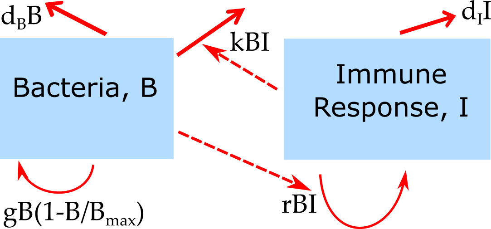

##Overview {#shinytab1}
This app allows exploration of a very basic bacteria infection model, with one compartment for bacteria and one compartment for the immune response. The main goal is to get you familiar with dynamical systems models, as well as the overall setup and ideas behind using these simulations, and how to run them. Read about the model in the "Model" tab. Then do the tasks described in the "What to do" tab.


##The Model {#shinytab2}

###Model Overview
This model is a compartmental model. Compartmental means that we place the agents/players/entities/individuals of interest into distinct compartments. We then only track the total number of individuals in each of these compartments. In this simple model, we track bacteria and some (fairly abstract) notion of immune response strength, using the following notation:

* **B** - bacteria 
* **I** - immune response

This model is of course very simple and abstract. However, as you will see, even with just 2 entities and their interactions, we can get interesting dynamics. This model could of course be extendend by introducing further compartments. For instance we could include separate compartments for the innate and adaptive immune response. Some of these extensions and more detailed models are implemented in some of the other apps.

In addition to specifying the *compartments* of a model, we need to specify the dynamics determining the changes for each compartment. Broadly speaking, there are processes that increase the numbers in a given compartment/stage, and processes that lead to a reduction. Those processes are sometimes called in-flows and out-flows. 

For our system, we specify the follwoing processes/flows: 

1. Bacteria grow/divide at some maximum rate (which we label _g_) and saturate as they approach some maximum carrying capacity, B~max~. 
2. Bacteria die at a natural death rate (which we label _dB_).
3. Bacteria are killed by the immune response at some rate _k_.
4. The immune response is triggered and grows proportional to the number of bacteria and itself, at some rate _r_.
5. The immune response decays at some rate (which we label _dI_).


###Model Diagram
A very good way to describe compartmental models and move from a verbal description to a more abstract and quantitative one is by showing a flow diagram. Such a diagram consists of a box for each compartment (here **B** and **I**), and arrows pointing in and out of boxes to describe flows and interactions. For the model described above, the flow diagram looks as follows:


```{r BIdiagram,  fig.cap='Flow diagram for simple bacteria infection model..',  echo=FALSE, out.width = "70%"}

```


For the flow diagrams in this R package, solid arrows indicate physical flows, i.e. movement from a compartment to another (e.g. bacteria moving out of the compartment because of death, or bacteria increasing in the compartment due to growth), while dashed arrows indicate interactions without physical flow (e.g. infected cells killing bacteria). This notation is not universal and it is common in the literature to see no distinction made between these 2 types of flows and only solid arrows being used.


Next, we need to implement this model and flow diagram in a way that it can be run on a computer. Two ways to do so are described next.


###Model Implementation I
The most common way to implement compartmental models is as a continuous time process, formulated as a set of ordinary differential equations. Each compartment/variable gets an equation. The right side of each equations specifies the processes going on in the system and how they change the numbers in each compartment via inflows and outflows. For the model described above, the equations look like this:

$$\dot B = g(1-\frac{B}{B_{max}})-d_B B - k BI$$ 
$$\dot I = r B I - d_I I$$

###Model Implementation II
Continouus time models implemented as ordinary differential equations are the most common types of models. However, other implementations of the above model are possible. One simple formulation is a discrete time-step equivalent to the ODE model. For such an implementation, the equations are:

$$B_{t+dt} = B_t + (g(1-\frac{B}{B_{max}})-d_B - k I_t)B_t dt$$ 
$$ I_{t+dt} = (r B_t - d_I) I_t dt$$
In words, the number of bacteria and immune response at a time step dt in the future is given by the number at the current time, t, plus/minus the various growth and death/removal processes. The latter need to be multiplied by the time step, since less of these events can happen if the time step is smaller. As the time-step gets small, this discrete-time model approximates the continous time model above.


###Some notes
* In general, the entities that change in our model (i.e. here **B** and **I**) are called variables: They are variable and change during the simulation. To run a simulation, we need to specify the starting values for each variable. Those are often called _initial conditions_.
* In contrast, the quantities that are usually fixed for a given scenario are called parameters. For this model, those are _g_, _dB_, _k_, _r_ and _dI_. We would usually choose the parameter such that they match the specific disease/scenario we want to study. 
 


##What to do {#shinytab3}

###Task 1: 
*

###Task 2: 

###Task 3: 


###Task 4: 


##Further Information {#shinytab4}
* This app (and all others) are structured such that the Shiny part (the graphical interface you see and the server-side function that goes with it) calls an underlying R script (or several) which runs the simulation for the model of interest and returns the results.
* For this app, the underlying function running the simulation is called `simulate_introduction.R`. You can call this function directly, without going through the shiny app. Type `?simulate_introduction` into the R console for more information. If you go that route, you need to use the results returned from this function and produce useful output (such as a plot) yourself. 
* You could also modify this R function for your own purposes - though that requires R coding knowledge.
* Some useful books which cover the material of this and most of the other apps (though often a somewhat more mathematical level) are [@vynnycky10] and [@keeling08].

### References


