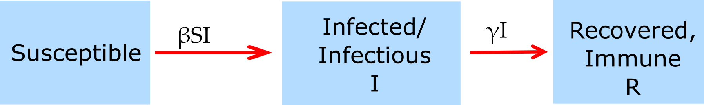

##Overview {#shinytab1}
This app allows exploration of a very basic infectious disease simulation. The main goal is to get you familiar with the overall setup and ideas behind using these simulations, and how to run them. Read about the model in the "Model" tab. Then do the tasks described in the "What to do" tab.

##The Model {#shinytab2}

###Model Overview
This model is a compartmental SIR model. Compartmental means that we place individuals into distinct compartments, according to some characteristics. We then only track the total number of individuals in each of these compartments. In the simplest model, the only characteristic we track is a person's infection status. We allow for 3 different stages/compartments: 

* **S** - uninfected and susceptible individuals 
* **I** - infected and infectious individuals (note that these terms are often used interchangably, but technically we are talking about someone who is infected **and** is infectious, i.e. can infect others)
* **R** - recovered/removed individuals. Those are individuals that do not further participate, either because they are now immune or because they died.

The SIR model is very basic. It could be extendend by introducing further compartments. For instance we could stratify according to gender, which would give us 2 sets of SIR compartments, one for males and one for females. Some of these extensions are implemented in some of the other apps.

In addition to specifying the *compartments* of a model, we need to specify the dynamics determining the changes for each compartment. Broadly speaking, there are processes that increase the number of individuals in a given compartment/stage, and processes that lead to a reduction. Those processes are sometimes called in-flows and out-flows. 

For our system, we specify only 2 processes/flows: 

1. A susceptible individual (S) can become infected by an infectious individual (I) at some rate (which is usually labeled b or $\beta$). This leads to the susceptible individual leaving the S compartment and entering the I compartment.   
2. An infected individual dies or recovers and enters the recovered/removed (R) compartment at some rate (often labeled as $\gamma$).

As with the compartments, we can extend the model and allow other processes to occur. For instance we could allow for natural births and deaths, waning immunity, deaths due to disease, etc. We will do that soon. For now, we keep the model as simple as possible.

###Model Implementation
To allow us to simulate and study this model, we need to implement it on the computer. For that purpose, it is often useful to write the model as mathematical equations (this is not strictly needed, some computer simluation models are never formulated as mathematical models). One way to formulate the simple SIR model is with a set of ordinary differential equations. Each compartment/variable gets an equation. The right side of each equations specifies the processes going on in the system and how they change the numbers in each compartment via inflows and outflows. For the model described above, the equations look like this:

$$\dot S = -\beta SI$$ 
$$\dot I = \beta S I - \gamma I$$
$$\dot R = \gamma I$$

Since not everyone likes equations :) a very good way to describe compartmental models is by showing a flow diagram. Such a diagram consists of a box for each compartment, and arrows pointing in and out of boxes to describe flows and interactions. For the simple SIR model, the flow diagram looks as follows:

###Some notes
* For many of the models, I will show their underlying equations. But you are not expected to know them or "do anything" with them.
* You will see the term *host* used instead of *individuals*. In general, while we most often think of humans, the host can be any kind of animal (or even a plant).
* In general, the entities that change in our model (i.e. here the number of individuals in compartments S, I and R) are called variables: They are variable and change during the simulation. 
* In contrast, the quantities that are usually fixed for a given scenario are called parameters. For this model, those are the infection rate $\beta$ and the recovery rate $\gamma$.
* We would usually choose the parameter such that they match the specific disease we want to study. We'll get to that soon. For now, you'll just play around with the model without trying to relate it to some specific ID.

##What to do {#shinytab3}

###Task 1: 
* Run the simulation with a population size of 1000, 1 initially infected host, simulation duration 100 days, recovery rate gamma=0.5 per day, and infectiousness beta=0.001. You will get an outbreak of some - currently unspecified - infectious disease. 
* Record the number and fraction of susceptible/infected/recovered remaining at the end of the outbreak.    
* From the graph, get a (rough) estimate of the day at which the outbreak peaks.
* Contemplate the fact that the outbreak ends even though there are still a good number of susceptible remaining, i.e. not everyone got infected. 
* Run the simulation again, with the same values you just had. Does anything change? Why (not)?

###Task 2: 
* Double the value of the transmission rate, beta. Leave everything else the same. 
* What do you expect to get for the number/fraction of S/I/R at the end of the outbreak and the time at which the outbreak peaks?
* Run the simulation with the doubled transmission rate, record the same values (final S/I/R and outbreak peak) as above.
* Compare your expectations with the results. How do they agree/disagree? Does it make sense? Anything surprising happening?

###Task 3: 
* Now, double the rate of recovery (gamma), leave everything as in #2.
* How do you expect the results to change? (Try to make your prediction as precise/quantitative as you can)
* Run the simulation with these new parameter settings, record the same values as above.
* Compare your expectations with the results. How do they agree/disagree? Does it make sense? Anything surprising happening?

###Task 4: 
* Now, double the number of susceptibles (i.e. the population size), leave everything as in #3.
* How do you expect the results to change?
* Run the simulation with these new parameter settings, record the same values as above.
* Compare your expectations with what results. How do they agree/disagree? Does it make sense? Anything surprising happening?

###Task 5: 
* Keep playing around with changing any of the parameters and starting conditions.
* Every time, think about what you expect to get, then run the simulation, compare your expectations with the results. Then make sense of it.
* What is the minimum and maximum number of outbreaks you can get? Why is that?

##Further Information {#shinytab4}
* This app (and all others) are structured such that the Shiny part (the graphical interface you see and the server-side function that goes with it) calls an underlying R script which runs the simulation for the model of interest and returns the results.
* For this app, the underlying function running the simulation is called `simulate_introduction.R`. You can call this function directly, without going through the shiny app. Type `?simulate_introduction` into the R console for more information. If you go that route, you need to use the results returned from this function and produce useful output (such as a plot) yourself. 
* You could also modify this R function for your own purposes - though that requires R coding knowledge.
* Some useful books which cover the material of this and most of the other apps (though often a somewhat more mathematical level) are [@vynnycky10] and [@keeling08].

### References

