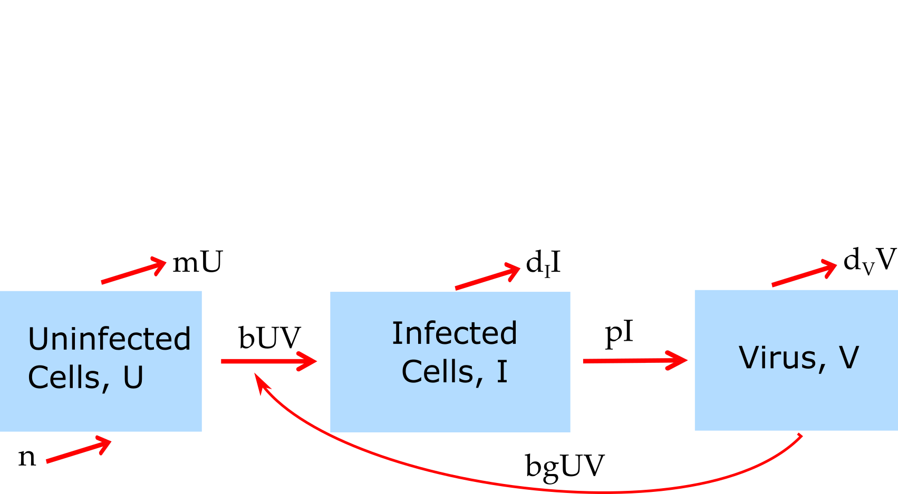

##Overview {#shinytab1}
This app allows exploration of a stochastic model that is almost identical to the deterministic basic virus infection model. In fact, both models are being run so comparison is possible. Read about the model in the "Model" tab. Then do the tasks described in the "What to do" tab.


##The Model {#shinytab2}

###Model Description
This model consists of 3 compartments and is almost identical to the deterministic basic virus infection model. We track the following entities, by assigning each to a compartment:

* **U** - uninfected cells 
* **I** - infected cells
* **V** - (free) virus


In addition to specifying the *compartments* of a model, we need to specify the dynamics determining the changes for each compartment. Broadly speaking, there are processes that increase the numbers in a given compartment/stage, and processes that lead to a reduction. 

For this model, we consider the following processes: 

1. Uninfected cells are produced at some rate _n_ and naturally die at some rate _dU_.
2. Virus infects cells at rate _b_.
3. Infected cells produce new virus at rate _p_ and die at rate _dI_.
4. Free virus is removed at rate _dV_ or goes on to infect further uninfected cells. 

The one difference to the deterministic virus model is that - for simplicity - we do not include an additional conversion factor to account for experimental units. That essentially means that the parameter _g_ of the deterministic model is set to 1.


###Model Diagram
The diagram illustrating this compartmental model is shown in the figure.

```{r BIdiagram,  fig.cap='Flow diagram for a simple virus infection model.',  echo=FALSE}

```


###Model Equations
*If* we were to implement this model as a continuous-time, deterministic model, it would have the following set of ordinary differential equations. 

$$\dot U = n - dU - bUV$$
$$\dot I = bUV - d_I I$$
$$\dot V = pI - d_V V - b UV$$

*However* we use a stochastic model here. For such a model, the differential equation formulation is not valid. One can write down an equivalent formulation as a stochastic model by specifying every possible process (also called transition/event/reaction) that can occur and their propensities (the propensity multiplied with the time step gives the probability that a given process/event/transition occurs). For our model these are the following:

Event type              |  Transitions                  |   Propensity      |
----------              |  -----------                  |   ----------      |
Production of U         |  U => U+1                     |   n*U            |
death/removal of U      |  U => U-1                     |   dU*U           |
infection               |  U => U-1, V => V-1, I => I+1 |   b*U*V           |
death if I              |  I => I-1                     |   dI*I          |
production of V         |  V => V+1                     |   p*I          |
removal of V            |  V => V-1                     |   dV*V          | 


##What to do {#shinytab3}

###Task 1: 
*

###Task 2: 

###Task 3: 


###Task 4: 


##Further Information {#shinytab4}

### References


