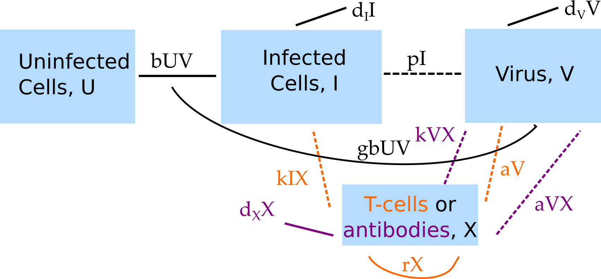

##Overview {#shinytab1}
This app shows some basic fitting of data to 2 simple infection models. This shows the concept of model/hypothesis testing. Read about the model in the "Model" tab. Then do the tasks described in the "What to do" tab.


##The Model {#shinytab2}

###Model Overview
This app fits 2 different models to virus load data from humans.

####Model 1

This model consists of 4 compartments. The following entities are modeled:

* **U** - uninfected cells 
* **I** - infected cells
* **V** - (free) virus
* **X** - T-cells

The following processes/flows are included in the model: 

* Virus infects cells at rate _b_.
* Infected cells produce new virus at rate _p_, are killed by T-cells at rate _k_ and die due to other causes at rate _d~I~_.
* Free virus is removed at rate _d~V~_ or goes on to infect further uninfected cells. It can also infect new cells at rate _b_, with unit conversion factor _g_.
* T-cells are activated proportional to virus at rate _a_ and undergo exponential growth at rate _r_.


####Model 2

This model also consists of 4 compartments. The following entities are modeled:

* **U** - uninfected cells 
* **I** - infected cells
* **V** - (free) virus
* **X** - B-cells/antibodies

The following processes/flows are included in the model: 

* Virus infects cells at rate _b_.
* Infected cells produce new virus at rate _p_ and die at rate _d~I~_.
* Free virus is removed by antibodies at rate _k_, and by other mechanisms at rate _d~V~_. It can also infect new cells at rate _b_, with unit conversion factor _g_.
* B-cells/antibodies grow exponentially proportional to virus at rate _a_ and decay at rate _d~X~_.


###Model Diagram
The diagram illustrates both compartmental models, with colors to indicate mechanisms that are part of either model 1 or model 2.

```{r BIdiagram,  fig.cap='Flow diagram for the 2 models.',  echo=FALSE}

```


###Model Equations
Implementing the models as continuous-time, deterministic systems leads to the following set of ordinary differential equations for model 1: 

$$\dot U =  - bUV$$ 
$$\dot I = bUV - d_I I - kIX$$
$$\dot V = pI - d_V V - gbUV$$
$$\dot X = a V + r X$$


Model 2 is described by these equations:
$$\dot U =  - bUV$$ 
$$\dot I = bUV - d_I I $$
$$\dot V = pI - d_V V - k V X - gbUV$$
$$\dot X = a V X - d_X X$$

###Comments
Note that both models are rather simple and - arguably - somewhat unrealistic. For instance the T-cells grow exponentially without any limit. This model can be justified if one only tries to fit data from an acute infection - as done here for influenza - where the infection is over (i.e. virus drops below level of detection) before T-cells reach their peak. For both models, we ignored birth/death of uninfected cells, which is possibly ok for an acute infection (but needs to be determined based on known biology for a given system). 

We also assume for model 2 that the dynamics of B-cells and antibodys track each other close enough that we can lump them together into a single equation.

In general, models need to be carefully tailored to the question and setting. This is true for models used in fitting even more than for models that are used without trying to perform data fitting.


###Data source
The data being used in this app comes from [@hayden96]. Specifically, the data being fit is the 'no intervention' viral load data shown in Figure 2 of the paper.

##What to do {#shinytab3}

*The tasks below are described in a way that assumes everything is in units of days (rate parameters, therefore, have units of inverse days). If any quantity is not given in those units, you need to convert it first (e.g. if it says a week, you need to convert it to 7 days).*


###Task 1: 


##Further Information {#shinytab4}

* For this app, the underlying function running the simulation is called `simulate_fitmodelcomparison.R`. You can call this function directly, without going through the shiny app. Type `?simulate_fitmodelcomparison` into the R console for more information on how to use the functions directly. 

### References


