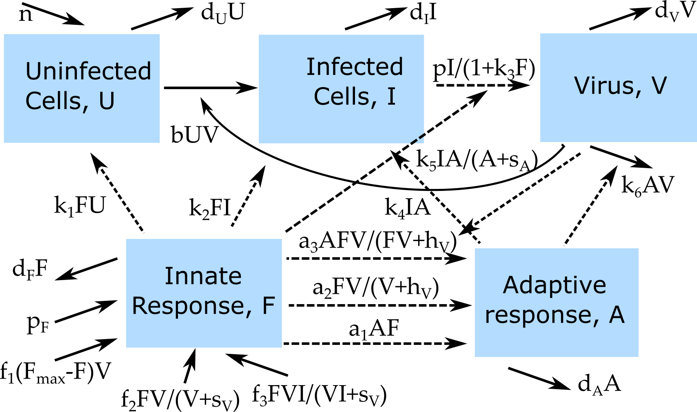

##Overview {#shinytab1}
This app allows exploration of the impact of different model formulations on the results obtained from a simulation. Read about the model in the "Model" tab. Then do the tasks described in the "What to do" tab.


##The Model {#shinytab2}

###Model Overview
This model consists of several compartments that capture some of the basic dynamics of virus and immune response during an infection. In this model, we track the following entities, by assigning each to a compartment:

* **U** - uninfected cells 
* **I** - infected cells
* **V** - (free) virus
* **F** - innate immune response
* **A** - adaptive immune response

Both the innate and adaptive response are modeled in a rather abstract manner. We could think of them as some kind of cumulative representation of each arm of the immune response, or alternatively a single dominant innate response component, e.g. interferon for the innate and CD8 T-cells for the adaptive response. 

In addition to specifying the *compartments* of a model, we need to specify the dynamics determining the changes for each compartment. Broadly speaking, there are processes that increase the numbers in a given compartment/stage, and processes that lead to a reduction. Those processes are sometimes called in-flows and out-flows. 

For the purpose of this app, we specify several alternative processes that allow us to explore different model variants by 'turning on and off' specific components of the model.

We specify the following processes/flows: 

* Uninfected cells are produced at rate _n_, die naturally at rate _d~U~_ and become infected at rate _b_.
* Infected cells die at rate *d~I~* and produce virus at rate _p_.
* Free virus is removed at rate _d~V~_ due to any unmodeled processes, or goes on to infect further uninfected cells at rate _b_. 
* In the absence of virus, the inate response is produced at a rate *p~F~* and removed at a rate *d~F~*. In the presence of virus, the innate response additionally *grows* according to 3 alternative model formulations:
    A) Proportional to virus at rate *f~1~* and saturating at a maximum level *F~max~*. 
    B) Proportional to virus at rate *f~2~*, with a growth rate saturating at high levels of virus, determined by the saturation constant *s~V~*. 
    C) Proportional to both virus and infected cells at rate *f~3~*, with a growth rate saturating at high levels of virus and infected cells, determined by the saturation constant *s~V~*.
* The innate response can also *act* on the system in 3 different ways: 
    A) By moving target cells into a "protected" state at rate *k~1~* where those cells can not become infected any longer.
    B) By inducing death of infected cells at rate *k~2~*. 
    C) By reducing production of virus particles at strength *k~3~*.
* The adaptive response *growth* is also modeled according to 3 alternative model formulations:
    A) Proportional to the innate response at rate *a~1~*. 
    B) Proportional to virus at rate *a~2~*, with a growth rate saturating at high levels of virus, determined by the saturation constant *h~V~*.
    C) Proportional to both virus and innate response at rate *a~3~*, with a growth rate saturating at high levels of virus and innate response, determined by the saturation constant *h~V*~.
* The adaptive response can *act* on the system in 3 ways: 
    A) By killing infected cells at rate *k~4~*. 
    B) By killing infected cells at rate *k~5~*, with saturation of the maximum killing rate for high adaptive response levels, determined by the saturation constant *s~A~*. 
    C) By killing virus at rate *k~6~*.
* Adaptive immune response decays at a rate *d~A~*.

The idea explored in this app and implemented by this model is that selecting different (biologically reasonable) ways the immune response is modeled, results sometimes, but not always, change. We can explore those different models by setting certain parameters describing alternative processes to a non-zero value, and all others to zero. We can then study how different model alternatives affect the outcome.

Obviously, the number of alternative models we could make that are biologically reasonable is virtually endless. The better the underlying biology of a given infection is known, the easier it is to pick one model formulation over another. In the end, for most infections, we still don't know enough to pick the "right" model. We often have to choose one or a few reasonable model candidates and hope that they approximate the underlying processes reasonably well.

###Model Diagram


```{r modelvariants,  fig.cap='Flow diagram for the model with different innate and adaptive response variants.',  echo=FALSE, out.width = "60%"}

```


###Model Equations


$$\dot U =n - d_U U - bVU - k_1FU $$
$$\dot I = bVU - d_II - k_2FI - k_4 A I - k_5 \frac{A I}{A+s_A}$$
$$\dot V = \frac{pI}{1+k_3 F} - d_VV - bVU - k_6AV$$
$$\dot F = p_F - d_F F + f_1  V (F_{max} - F) + f_2  \frac{V}{V+s_V} F + f_3  \frac{VI}{VI+s_V} F$$
$$\dot A = a_1 F A + a_2\frac{V}{V+h_V}F + a_3  \frac{F  V}{ F  V + h_V}  A $$


##What to do {#shinytab3}

_It is recommended that you before working your way through this app and tasks, you first explore and do the tasks in the "Basic Virus Model" and "Virus and Immune Response Model" apps._ 


###Task 1: 
* Try to figure out how to set parameter values such that you get a single acute virus infection with no immune response present.
* 

###Task 2: 

###Task 3: 


##Further Information {#shinytab4}
* For this app, the underlying function running the simulation is called `simulate_modelvariants.R`. You can call these functions directly, without going through the shiny app. Look at the help file for the function to learn how to use the functions directly. If you go that route, you need to use the results returned from this function and produce useful output (such as a plot) yourself. 
* You could also modify this R function for your own purposes - though that requires R coding knowledge.
* Explorations of different models and their impacts on outcomes for acute virus infections in general can be found in e.g. [@li14] and a more detailed discussion of previously published models and comparison to data for influenza can be found in [@dobrovolny13]. 

### References


