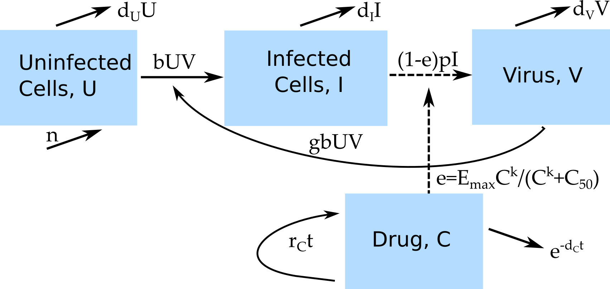

##Overview {#shinytab1}
This app allows exploration of a basic virus infection model in the presence of treatment. Drug pharmacokinetics (Pk) and pharmacodynamics (Pd) is included in the model. Read about the model in the "Model" tab. Then do the tasks described in the "What to do" tab.


##The Model {#shinytab2}

###Model Overview
This model consists of 4 compartments and can capture some of the basic dynamics of viral infections. In this model, we track the following entities, by assigning each to a compartment:

* **U** - uninfected cells 
* **I** - infected cells
* **V** - (free) virus
* **C** - drug levels

In addition to specifying the *compartments* of a model, we need to specify the dynamics determining the changes for each compartment. Broadly speaking, there are processes that increase the numbers in a given compartment/stage, and processes that lead to a reduction. Those processes are sometimes called in-flows and out-flows. 

For our system, we specify the following processes/flows: 

* Uninfected cells are produced at some rate _n_ and naturally die at some rate _dU_.
* Virus infects cells at rate _b_.
* Infected cells produce new virus at rate _p_ and die at rate _dI_.
* Free virus is removed at rate _dV_ or goes on to infect further uninfected cells. 
* Once treatment has started (*t>txstart*), drug kinetics is modeled as growing linearly at a rate *g~C~* and decaying exponentially at rate *d~C~*. This describes the kinetics of many drugs fairly well. The growth and decay pattern repeats itself each treatment interval (*txinterval*)
* The efficacy of the drug, *e*, depends on the concentration of the drug, given by a so called Emax-equation. *E~max~* is the maximum efficacy at high drug concentration, *C~50~* is the drug concentration at which the drug has half its maximum efficacy, and the parameter *k* dictates how rapidly efficacy increases as drug concentration increases.

Note that in this model, the drug concentration is not modeled using a differential equation. Instead, it is expressed directly as a time-dependent function.

###Model Diagram
The diagram illustrating this compartmental model is shown in the figure.

```{r PkPddiagram,  fig.cap='Flow diagram for a virus infection model with PkPd.',  echo=FALSE, out.width='70%'}

```


###Model Equations
Implementing this model as a continuous-time, deterministic model leads to the following set of ordinary differential equations. 

$$\dot U = n - dU - bUV$$ 
$$\dot I = bUV - d_I I$$
$$\dot V = (1-e)pI - d_V V - gb UV$$
$$e = E_{max} \frac{C^k}{C^k+C_{50}}$$
$$C = t_n g_Ce^{-d_C t_n}$$ 
Where *t~n~* is the time since the last dose was given. Prior to treatment start, *C=0*.


##What to do {#shinytab3}

*The tasks below are described in a way that assumes everything is in units of days (rate parameters, therefore, have units of inverse days). If any quantity is not given in those units, you need to convert it first (e.g. if it says a week, you need to convert it to 7 days).*

_To come_

##Further Information {#shinytab4}

* For this app, the underlying function running the simulation is called `simulate_pkpdmodels.R`. You can call these functions directly, without going through the shiny app. Type `?simulate_pkpdmodel` into the R console for more information on how to use the functions directly. If you go that route, you need to use the results returned from this function and produce useful output (such as a plot) yourself. 
* You could also modify this R function for your own purposes - though that requires R coding knowledge.
* If you want to learn a bit more about these kinds of models, see e.g. [@handel09b]. 


### References


