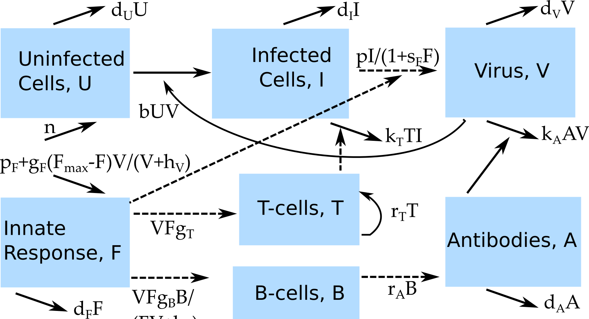

##Overview {#shinytab1}
This app allows exploration of a virus infection model that includes several components of the immune response. Read about the model in the "Model" tab. Then do the tasks described in the "What to do" tab.


##The Model {#shinytab2}

###Model Overview
This model consists of several compartments that capture some of the basic dynamics of virus and immune response during an infection. In this model, we track the following entities, by assigning each to a compartment:

* **U** - uninfected cells 
* **I** - infected cells
* **V** - (free) virus
* **F** - innate immune response
* **T** - CD8 T-cells
* **B** - B-cells
* **A** - Antibodies

The innate response is modeled in a rather abstract sense. We could think of it as some form of cumululative effect of all innate response components, or alternatively a single dominant innate response component, e.g. interferon. If one knows more about a specific system and has enough data, one can of course include the innate response in more detail (i.e. with several compartments) in the model. For the sake of simplicity, we only look at a single compartment.

In addition to specifying the *compartments* of a model, we need to specify the dynamics determining the changes for each compartment. Broadly speaking, there are processes that increase the numbers in a given compartment/stage, and processes that lead to a reduction. Those processes are sometimes called in-flows and out-flows. 

For our system, we specify the following processes/flows: 

1. Uninfected cells are produced at some rate _n_ and naturally die at some rate _dU_.
2. Virus infects cells at rate _b_.
3. Infected cells die at rate _dI_ and are killed by T cells at rate *k_T_*.
4. Free virus is produced at a maximum rate _p_, the innate response supresses virus production at a strengh given by the parameter *s_F_*. Virus is removed at rate *k_A_* by antibodies, at rate _dV_ due to any other (unmodeled) processes, or goes on to infect further uninfected cells at rate _b_. 
5. The inate response is produced at a rate *p_F_* and removed at a rate *d_F_* in the absence of an infection. It is induced by virus presence at a maximum rate *g_F_*, which saturates for high virus numbers as determined by the parameter *h_V_* and reaches a maximum carrying capacity given by **F_max_**.
6. T-cells are induced by the presence of virus and the innate response, with a saturation for high virus and immune response levels determined by parameter *h_F_*. After induction, T-cells grow exponentially at rate *g_T_*.
7. B-cells are induced and grow proportional to virus and innate response levels at a rate *g_B_*, with a saturation for high virus and immune response levels determined by parameter *h_F_*
8. Antibodies are produced by B-cells at rate *r_A_*, decay at rate *d_A_* and are removed through binding to and clearing virus at rate *k_A_*.

We are ignoring the death of T-cells and B-cells in this model. As such, it is only applicable to systems where we want to study the dynamics during the growth/expansion phase of the adaptive response and not further. This is valid for most acute infections, but would not be a suitable model for something like HIV or other chronic viral infections.

While this model and these processes make some biological sense, there are many other possible alternatives one could formulate the detailed processes going on. Based on what you know about the system you want to model, you might have good information about some of the components and for other parts you will have to make reasonable assumptions. Another app deals specifically with this issue of having different ways to formulate a model and how that can sometimes impact results.


###Model Diagram
The diagram illustrating this compartmental model is shown in the figure.


```{r VirusIR,  fig.cap='Flow diagram for virus infection model with several immune response components.',  echo=FALSE}

```


###Model Equations
Implementing this model as a continuous-time, deterministic model leads to the following set of ordinary differential equations. 

$$\dot U = n - d_U U - bUV$$ 
$$\dot I = bUV - d_I I - k_T T I$$
$$\dot V = \frac{pI}{1+s_F F} - d_V V - b UV - k_A AV$$
$$\dot F = p_F - d_F F + \frac{V}{V+ h_V}g_F(F_{max}-F) $$ 
$$\dot T = \frac{F V}{F V + h_F} + g_T T$$

$$\dot B = \frac{F V}{F V + h_F} g_B B$$
$$\dot A = r_A A - d_A A - k_A A V$$

    


##What to do {#shinytab3}

###Task 1: 

###Task 2: 

###Task 3: 


##Further Information {#shinytab4}

* For this app, the underlying function running the simulation is called `simulate_virusandIR.R`. You can call these functions directly, without going through the shiny app. Look at the help file for the function to learn how to use the functions directly. If you go that route, you need to use the results returned from this function and produce useful output (such as a plot) yourself. 
* You could also modify this R function for your own purposes - though that requires R coding knowledge.
* An example of a model similar to the above applied to influenza, see e.g. [@handel10]. 


### References


