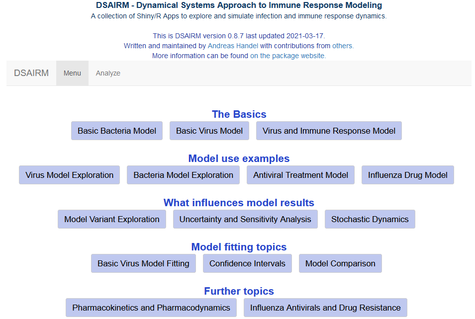
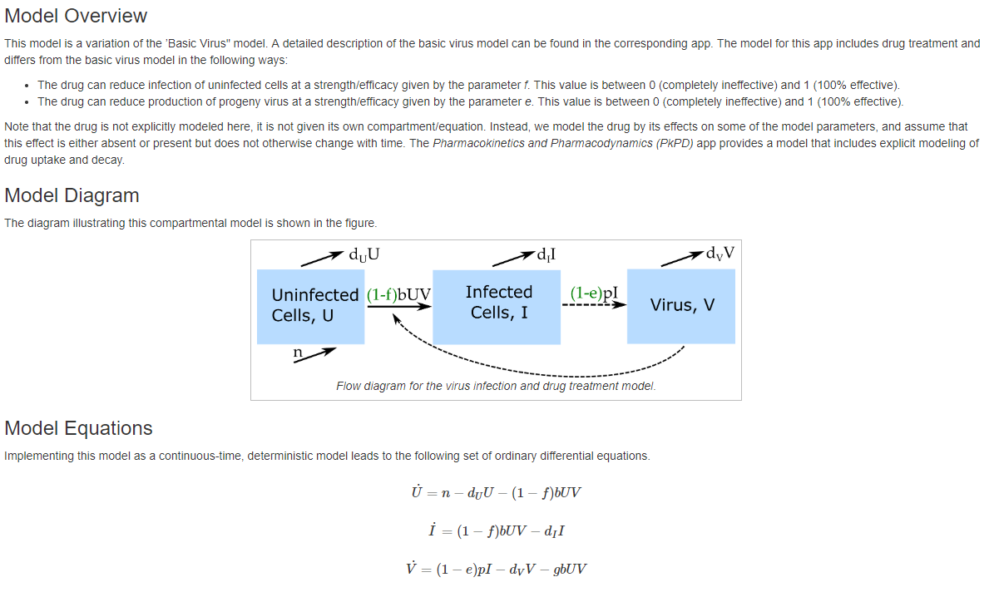

## Summary
_Dynamical Systems Approaches to Immune Response Modeling (DSAIRM)_ is an R package that allows 
you to explore and learn about dynamical systems modeling of within-host infection and immune response dynamics. 
The main way of interactin with the models is through a graphical user interface. It is not necessary - though possible - to read or write computer code.

The package also provides a path toward using and building your own models by relatively seamlessly moving from the graphical user interface to direct interaction with pre-written simulations all the way to modifying the underlying simulations to fit your needs. 

The different use cases for the package are described below.


## Package description
The package consists of several simulations/apps that allow for the simulation and exploration of different topics in within-host infection and immune response dynamics.

The underlying models are written as compartmental dynamical models, either deterministic using differential equations (deSolve package) or stochastic using a Gillespie-type approach (adaptivetau package). A graphical user interface is wrapped around each simulation/app. The graphical user interface is written using the functionality of the R Shiny package. This allows exploration of models and concepts without the need to write any code. At the same time, the package is structured in a way that should allow those interested in the actual models and learning R coding to easily move from one stage to another.

Each app is meant to be fully self-explanatory and contains a description of the model, a list of tasks the user could try, and further information on background reading and other resources. 


## Intended audience and goal of the package
The main audience are individuals who want to learn how mechanistic, dynamical systems models can be used to study within-host infection dynamics. While the ideal use of this package is likely as component of a class on this topic, self-learning might also be possible. Each app contains a fair amount of documentation and description of the model. By reading the model description, doing the tasks and probably also reading some of the papers in the future information section, it might be possible to teach yourself the beginnings of within-host modeling on your own.


## Installation

I assume you have [R](https://www.r-project.org/) installed. I also highly recommend [RStudio](https://www.rstudio.com/products/rstudio/download/), though it's not required. After having opened R/Rstudio, you can install the package from CRAN by typing the following into the R console (the bottom left window if you are using RStudio):


```r
install.packages('DSAIRM')
```


Alternatively, you can install the latest development version (with usually both more features and more bugs) from github, using the `devtools` package. The following commands, typed into the `R` console, will get you up and running:

```r
install.packages('devtools') #if not already installed
devtools::install_github('ahgroup/DSAIRM')
```

The package depends on other packages, which will also be installed as needed. Package installation is a one-time process, unless you update or reinstall R itself, or want to install a newer version of DSAIRM. 

## Using the package

The following sections describe the main envisioned ways the content in this R package can be used and extended. The idea is that you start at level 1, and then depending on needs and interests, you can decide to move on to the next level.


### Level 1: Interactive use through the graphical user interface

The interactive exploration of the models and infectious disease concepts through the graphical user interface is the main intended use of this package. The steps to get there are simple. 

#### Load and run the package

After install, load the package by typing the following into the `R` console. 

```{r, eval=FALSE, echo=TRUE}
library('DSAIRM')
```

You need to load the package every time you start a new R/Rstudio session. 


If the package loads correctly, you should receive a short greeting. 
Now you can open the main menu by typing the following into the `R` console:

```{r, eval=FALSE, echo=TRUE}
dsairmmenu()
```


If successful, you should see a graphical menu open in your browser that looks like this:

```{r dsaidemenu,  fig.cap='Main menu of the DSAIRM package.', echo=FALSE}

```

From the main menu, you can choose the different apps corresponding to different modeling topics and scenarios. 
Each app has the inputs you can set on the left and the outputs (figures and text) on the right. This is an example of one of the apps:

```{r appexample,  fig.cap='Screenshot of the input-output elements of one of the apps.', echo=FALSE}
knitr::include_graphics("appexample.png")
```

As seen in the figure above, below each app are four tabs with different sections providing information and instruction. The _Overview_ and _Further Information_ tabs provide a brief introduction and pointers to further exploration options, respectively.

The two most important tabs are the _Model_ and _What to do_ tabs. The _Model_ tab gives a detailed description of the model underlying the app, shows the model diagram and equations, and provides any other further information needed to understand what is going on. The following figure shows an example of this for one of the apps.

```{r modelexample,  fig.cap='Screenshot of the _Model_ section of one of the apps.', echo=FALSE}

```


The _What to do_ tab contains a list of suggested tasks you might want to go through. By doing those tasks, you will learn the topic a specific app is meant to teach. The following figure shows an example for part of one of those _What to do_ sections for one of the apps. 

```{r whattodoexample,  fig.cap='Screenshot of the _What to do_ section of one of the apps.', echo=FALSE}
knitr::include_graphics("whattodoexample.png")
```


Once you finished exploring a specific app, you can return to the main menu. Eventually, you can exit back to the `R` console by clicking the _Exit_ button. You will not need to read or write any code at this level of exploration and learning. If an when you want to learn more, you can proceed to level 2.


### Level 2: Directly interacting with the simulation functions


Once you are comfortable interacting with the models and have a good understanding of the concepts covered by the different apps, it is possible, without too much effort, to interact with the simulation models directly. This provides more flexibility at the cost of writing a limited amount of code. 

To facilitate direct interaction and modification of the underlying simulations, each app is structured in such a way that the underlying model/simulation is a stand-alone function. For some apps, there are multiple underlying functions involved. You can call any of these functions directly, without going through the graphical interface. The _Further Information_ tab inside each app provides the name of the corresponding underlying function(s) and how to call their help files to get information on their use.

Consider as example the first app, called "Basic Bacteria Model". This model has 2 underlying simulator functions, one that runs the discrete-time model called `simulate_basicbacteria_discrete` and one that runs the continuous, differential equation model called `simulate_basicbacteria_ode`. Assume you want to learn more about the latter model.

After loading the package (if not already loaded) with 

```{r, eval=TRUE, message=FALSE}
library('DSAIRM')
```

you can learn about the inputs and outputs of the model/function by looking at its documentation 

```{r eval=FALSE, echo=TRUE}
help('simulate_basicbacteria_ode')
```

The help file explains that one can run the simulation by specifying initial number of bacteria and immune response strength, the different model parameters, as well as some time values. Each parameter has some default, listed in the help file. Running a simulation model without any specifications runs it with the defaults:

```{r, eval=TRUE, echo=TRUE}
result <- simulate_basicbacteria_ode()
```

Calling the simulation function execuctes the underlying dynamical model (which is described in the "Model" section of the app). Most simulation functions produce and return time-series for the dynamics of each of the variables that are tracked as a list. You can then take the results returned from the simulation function and further process them. For instance you could plot the time-series for susceptible as function of time:

```{r, eval=TRUE, echo=TRUE}
plot(result$ts[ , "time"],result$ts[ , "B"],xlab='Time',ylab='Bacteria',type='l')
```

You can overwrite the default settings by providing your own values for specific parameters, as shown in the next example, which sets the rate at which bacteria grow, _g_, and the rate at which the immune response is induced and grows, _r_, to values different than the defaults, while using the default values for the remainder (this is equivalent to setting different inputs through the graphical interface in level 1):  


```{r, eval=TRUE, echo=TRUE}
result <- simulate_basicbacteria_ode(g = 0.5, r = 0.002)
plot(result$ts[ , "time"],result$ts[ , "B"],xlab='Time',ylab='Bacteria',type='l')
```

Any values that you do not specify will be kept at their defaults.

Note that unless explicitly specified, the models do not have inherent time units. Instead, those depend on the time units you choose for the parameters. It is important to ensure that all quantities (parameters and time settings) have the same time units, e.g. days or months (or the inverse of those units for the rate parameters). 

Not all simulator functions return time-series. For instance the function underlying the uncertainty and sensitivity app returns specific outcomes (maximum and final state of variables) for different parameter values. In every instance, the documentation for the function explains what is returned, so you know how to take the returned results and further process them.
 

The ability to call the simulation functions without using the graphical interface allows for more flexibilty in exploring the models. For instance if you wanted to explore the behavior of a model systematically for different values of a given parameter, this would need to be done manually through the graphical interface. Calling the function directly allows you automate this. As an illustration, assume you wanted to know how the peak bacteria load changes with changes in the immune response activation rate ,_r_, (while keeping all other parameters at some specified fixed values). The following lines of code show how this can be achieved. A loop is run over different _r_ values, for each _r_ value the simulation is run and the peak of the bacteria is recorded. At the end, peak of bacteria as function of immune activation rate is plotted:

```{r, eval=TRUE, echo=TRUE}
#values for immune activation rate, r, for which to run the simulation
rvec = 10^seq(-5,-2,length=20)  
#this variable will hold the peak values for each r
Bpeak = rep(0,length(rvec)) 
for (n in 1:length(rvec))   
{
  #run the simulation model for different values of r 
  #for simplicity, all other inputs are kept at their defaults
  result <- simulate_basicbacteria_ode(r = rvec[n])
  #record max number of bacteria for each value of r
  Bpeak[n] <- max(result$ts[,"B"]) 
}
#plot final result
plot(rvec,Bpeak,type='p',xlab='Immune activation rate',ylab='Peak bacteria',log='xy')
```

Thus, you can add your own custom code to the existing simulator functions and with a few lines of extra code analyze and explore many more questions and scenarios than those accessible through the graphical interface. This provides a lot more flexibility, but requires writing some R code to interface with the supplied simulator functions. 


### Level 3: Modifying the simulation functions

While level 2 provides the user with a fair amount of flexibility and the ability to investigate the models and ask questions that would be hard or impossible going through the graphical interface, there is still one major constraint. Namely this approach only allows use and analysis of pre-written, existing simulation models. This constraint can be overcome by directly modifiying and customizing the underlying simulation functions. As was true for moving from level 1 to 2, this move from level 2 to what I call level 3 provides further (almost unlimited) flexibility at the cost of having to write increasingly more `R` code.

To make modifying the existing functions easy, copies of all simulator functions are provided in a folder called _simulatorfunctions_ which can be downloaded as a zip file from the main menu. Each function in that folder starts with `simulate_`. The _Further Information_ section in each app tells you which simulator function goes with which app.

The code for each simulator function is (hopefully) well documented. Some basic to intermediate level of `R` coding experience is likely required to successfully modify the functions. In addition to modifying the simulator function of interest, you will likely also have to write some additional code to interact with their modified function (as described in _Level 2_).

To provide an example of this approach, assume you have a system and question for which the basic bacteria ODE model tracking only bacteria and immune response is reasonable, however the DSAIRM model is not fully suitable. Instead, for your system, you need a model in which the immune system growth term includes saturation at some maximum rate when bacteria numbers are high. This can be accomplished by a change of the term _rBI_ to _rBI/(B+s)_. (See the documentation for this app for an explanation of each model term and corresponding equation). This change leads to a growth at rate _rB_ proportional to the number of bacteria if _B_ is smaller than some threshold parameter _s_, and turns into a growth at fixed maximum rate _r_, independent of bacteria numbers, if _B_ is larger than _s_. 

To implement this, get the code for this model, which is `simulate_basicbacteria_ode.R`. (To make things easy, the name of a `.R` file containing the code and the name of the function itself are the same.) After finding the file, make a copy and rename it (called `mysimulator.R` here). 

Then open the file (ideally in RStudio) and make the following modifications to the code:

old:
```{r eval=FALSE, echo=TRUE}
simulate_basicbacteria_ode <- function(B = 10, I = 1, g = 1, Bmax = 1e+05, dB = 0.1, k = 1e-06, r = 0.001, dI = 1, tstart = 0, tfinal = 30, dt = 0.05)
```

new:
```{r eval=FALSE, echo=TRUE}
mysimulator <- function(B = 10, I = 1, g = 1, Bmax = 1e+05, dB = 0.1, k = 1e-06, r=1e3, dI=1, tstart = 0, tfinal = 30, dt = 0.05, s=1E3)
```

Note the changed default value for _r_ to ensure the immune response is sufficiently triggered.

old:
```{r eval=FALSE, echo=TRUE}
pars = c(g=g,Bmax=Bmax,dB=dB,k=k,r=r,dI=dI)
```

new:
```{r eval=FALSE, echo=TRUE, color='red'}
pars = c(g=g,Bmax=Bmax,dB=dB,k=k,r=r,dI=dI,s=s)
```


old:
```{r eval=FALSE, echo=TRUE}
dBdt = g*B*(1-B/Bmax) - dB*B - k*B*I
dIdt = r*B*I - dI*I
```

new:
```{r eval=FALSE, echo=TRUE}
dBdt = g*B*(1-B/Bmax) - dB*B - k*B*I
dIdt = r*B*I/(s+B) - dI*I
```


With these changes made, it is now possible to use the new `mysimulator` function to ask specific questions regarding this model, and thus the underlying biological system of interest for which this model is a - hopefully useful - approximation. For instance, you can explore how different values of the saturation parameter _s_ impact the maximum level of the immune response. This requires a slight modification of the code shown above in _Level 2_ as follows, the resulting plot is shown in Figure \@ref(fig:l2l3fig)B.

```{r eval=FALSE, echo=TRUE}
#initialize the new function
#it needs to be in the same directory as this code
source('mysimulator.R') 
#values of saturation parameter to explore
svec = 10^seq(-3,3,length=20)  
#this will record the maximum immune response level
Ipeak = rep(0,length(svec)) 
for (n in 1:length(svec))
{
  #run the simulation model for different values of s 
  #for simplicity, all other inputs are kept at their defaults
  result <- mysimulator(s = svec[n]) 
  #record max immune response for each value of s
  Ipeak[n] <- max(result$ts[,"I"])
}
plot(svec,Ipeak,type='p',xlab='Saturation parameter, s',ylab='Peak immune response',log='xy')
```

Using one of the provided simulator functions as starting point and modifying it is likely easier than having to write a new model completely from scratch. Eventually, as you gain more coding experience, you have (almost) unlimited flexibility and power regarding the models you can create and questions you can address, of course at the cost of having to write increasingly more `R` code. You are essentially only limited by what can be accomplished using the `R` programming language and your ability and interest in writing their own customized code. 


## Contributing to the package
The package is on GitHub and you can use the usual GitHub process to file bug reports, send feature requests, contribute updates and bug fixes, etc. If you have any comments or feedback, I very much welcome them. Please file a [GitHub issue](https://github.com/ahgroup/DSAIRM/issues) and let me know what you think.

The package is built in a way that makes it (hopefully) easy for others to contribute new simulations/apps. To that end, the package contains [this Markdown file](https://github.com/ahgroup/DSAIRM/blob/master/inst/docsfordevelopers/documentation.md) which provides further information on the details of the package structure. If you plan to develop new apps, or make other substantial contributions, it's best to get in touch with me first via email or GitHub.

## Further information
* A 'companion' package to this one, called Dynamical Systems Approaches for Infectious Disease Epidemiology (DSAIDE), focuses on models for infectious disease epidemiology (the population level). It has the same structure as DSAIRM. [See the DSAIDE site for more information.](https://ahgroup.github.io/DSAIDE/index.html)
* I have solutions (in progress) to most of the 'What to do' tasks for the different apps. If you are an instructor using this package as part of a class, email me if you are interested in having access to these solutions.

## Contributors
This R package is developed and maintained by [Andreas Handel](http://handelgroup.uga.edu/). A full list of contributors [can be found here](https://ahgroup.github.io/DSAIRM/authors.html).

## References


